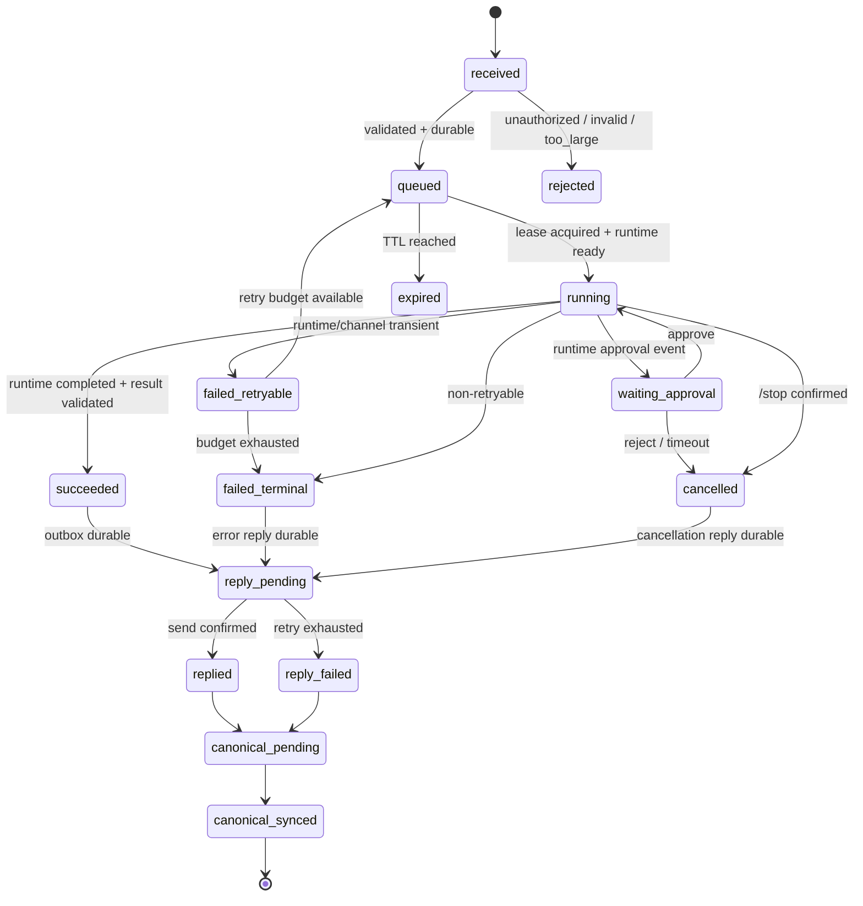

# 02 — PRD 与 Acceptance Contract

## 1. 产品定义

### 1.1 产品名称

**CyberBoss Cloud**

### 1.2 版本

`v0.0.0.4` — Single-user All-cloud MVP

### 1.3 一句话定义

一个以微信为主要入口、在 OVH 云端 7×24 运行 Codex、通过
`Private-MetaDatabase` 免 clone 协议保持结构化事实、通过 Timeline/status
提供可见性，并能从短暂故障中无静默丢失恢复的白箱受控 Agent 系统。

### 1.4 用户

| Persona | 角色 | 目标 | 能力边界 |
|---|---|---|---|
| P-USER | Linze Zhang | 随时通过微信提交任务、查看状态和 Timeline | 唯一授权微信用户；不需要理解底层代码 |
| P-DEV | Codex / Claude Code | 依任务 DAG 开发、测试、部署和修复 | 只在允许目录、分支、权限和 Feature Flag 内操作 |
| P-OPS | 同一用户 | 查看 status、触发明确恢复/回滚 | 不承担日常手工守护；高风险操作需明确命令 |
| P-SYSTEM | Deterministic automation | status、self-heal、backup、sync | 不调用 LLM、不持有不必要权限、不做产品决策 |

---

## 2. 问题陈述

### 2.1 当前问题

1. 原始使用方式依赖本机，不能满足真正全云 7×24。
2. 微信长轮询 cursor 与消息处理没有明确事务边界，存在崩溃丢失窗口。
3. 出站发送与任务执行状态没有 durable outbox 语义，结果可能生成但用户未收到。
4. 多实例/重复启动可能导致重复处理和重复回复。
5. Runtime、微信、Timeline、状态、数据和备份缺少统一生命周期。
6. Private-Database/R2/OCI 的职责不清会导致数据重复、冲突或 OVH 爆盘。
7. 只有进程级 health，无法知道微信 poll、send、Runtime 和真实 E2E 是否有效。
8. OVH 实时资源余量有限，未经约束的多 Agent、多仓库、附件和重型服务会挤压现有系统。

### 2.2 成功状态

用户发出微信文本后，系统明确回复 accepted/job ID；消息持久化且最多执行
一次；Codex 在 OVH 受控 workspace 中真实执行；结果通过 durable outbox
可靠回复；终态事实同步到 `Private-MetaDatabase` 的 `domain=CyberBoss`；
Timeline 和 status 能解释发生了什么；重启、短暂网络故障和常见进程故障
不会造成静默丢失。

---

## 3. 范围边界

### 3.1 In Scope

- 单一微信账号和单一授权用户；
- 文本消息；
- Codex 主 Runtime；
- Claude Code 预装/接口预留但默认关闭；
- 单一 active job，其他任务 FIFO 排队；
- allowlisted workspace aliases；
- durable inbox、job、events、outbox、canonical sync spool；
- `/status`、`/stop`、`/new`、`/bind <alias>`、`/timeline`、`/help`；
- Private-MetaDatabase canonical ledger；
- Timeline 只读站点与轻量搜索；
- status snapshot 和全局 status 集成；
- R2 snapshot、OCI 后续备份接口；
- Cloudflare Access 与 Web Analytics；
- systemd、self-heal、backup、restore、release/rollback；
- 软件与模型双流水线。

### 3.2 Out of Scope

参见 `00_README_FIRST.md §2.3`。开发者不得把 out-of-scope 项作为“顺手优化”混入。

---

## 4. 用户故事

| ID | 用户故事 | 优先级 |
|---|---|---:|
| US-001 | 作为用户，我在 Mac 关机时也能通过微信发任务并得到云端 Codex 的真实结果 | P0 |
| US-002 | 作为用户，我希望每条任务先收到 accepted/job ID，以便知道系统已经可靠接收 | P0 |
| US-003 | 作为用户，我希望重复发送或微信重放不会让同一任务执行两次 | P0 |
| US-004 | 作为用户，我希望结果暂时发不出去时系统重试并明确显示 pending，而不是假装成功 | P0 |
| US-005 | 作为用户，我希望 `/status` 一眼看到微信、Runtime、队列、同步、备份和资源是否健康 | P0 |
| US-006 | 作为用户，我希望通过 alias 选择项目，不需要也不能在微信输入任意服务器路径 | P0 |
| US-007 | 作为用户，我希望在 Timeline 查看任务、关键事件、日记和 check-in 的顺序与结果 | P1 |
| US-008 | 作为用户，我希望 OVH 重启后服务自动恢复，未完成任务不消失 | P0 |
| US-009 | 作为用户，我希望 Private-MetaDatabase 能解释历史并帮助重建，而非只依赖一台 VPS | P0 |
| US-010 | 作为用户，我希望空间和内存不足时系统主动降级，而不是把其他项目一起拖垮 | P0 |
| US-011 | 作为运维者，我希望一条命令能诊断、备份、恢复或回滚 | P1 |
| US-012 | 作为系统所有者，我希望 Claude Code 后续可替换 Codex，但不能未经评测自动切换 | P2 |
| US-013 | 作为开发委托人，我希望凭据、扫码和外部激活不阻塞可并行开发，也不出现真实时间 Soak | P0 |

---

## 5. 功能需求

### 5.1 Channel 与身份

| ID | Requirement | Priority | Acceptance ID |
|---|---|---:|---|
| FR-001 | 系统必须使用上游微信 iLink adapter 完成二维码登录、长轮询和文本回复，不另造微信协议 | P0 | AC-001 |
| FR-002 | 只有配置白名单中的微信 user ID 可提交任务；其他用户仅记录拒绝事件，不调用 Runtime | P0 | AC-002 |
| FR-003 | 每条入站消息必须生成或复用唯一 `source_message_id`、`correlation_id` 和 `job_id` | P0 | AC-003 |
| FR-004 | 入站消息必须先成功写入 durable inbox，再持久化新的微信 sync cursor | P0 | AC-004 |
| FR-005 | 系统必须在持久接收后尽快返回 accepted + job ID；失败时明确返回未接受 | P0 | AC-005 |
| FR-006 | 单条输入长度默认上限 32 KiB；超限拒绝且不进入 Runtime | P0 | AC-006 |

### 5.2 任务与 Runtime

| ID | Requirement | Priority | Acceptance ID |
|---|---|---:|---|
| FR-010 | Runtime 必须在 OVH 本机运行，不依赖 Mac、家庭网络或远程本地连接器 | P0 | AC-010 |
| FR-011 | Codex 为默认 Runtime；App Server 只监听 `127.0.0.1`，不得绑定公网接口 | P0 | AC-011 |
| FR-012 | 同一时刻最多一个 active job；其他任务 FIFO 排队 | P0 | AC-012 |
| FR-013 | Runtime 必须只在 allowlisted workspace alias 对应目录内操作 | P0 | AC-013 |
| FR-014 | `/bind` 只接受 alias；未知 alias 拒绝，微信不得传任意绝对路径 | P0 | AC-014 |
| FR-015 | `/stop` 必须请求停止 active turn，并把最终真实状态记录为 cancelled/failed/succeeded，不得假成功 | P0 | AC-015 |
| FR-016 | 每个 job 必须记录 queued、running、waiting_approval、succeeded、failed、cancelled 或 expired 状态转换 | P0 | AC-016 |
| FR-017 | Claude Code adapter 必须受 `CB_CLAUDE_RUNTIME=false` 控制；未通过同套 eval 不得启用 | P1 | AC-017 |

### 5.3 回复、重试与幂等

| ID | Requirement | Priority | Acceptance ID |
|---|---|---:|---|
| FR-020 | 结果必须先写 durable outbox，再调用微信 sendmessage | P0 | AC-020 |
| FR-021 | 可重试发送失败必须采用有上限的指数退避，默认最多 5 次；重试状态可见；全部时间逻辑必须支持虚拟时钟测试 | P0 | AC-021 |
| FR-022 | 相同 outbox key 重试不得产生多个最终用户可见结果 | P0 | AC-022 |
| FR-023 | 相同 source message 重放不得生成第二次 Runtime execution | P0 | AC-023 |
| FR-024 | 不可重试错误必须进入 failed_terminal 并给出脱敏、可操作的用户回复 | P0 | AC-024 |
| FR-025 | 超长结果必须分段或生成受保护页面引用；每段有顺序和总数 | P1 | AC-025 |

### 5.4 Canonical Data、Timeline 与搜索

| ID | Requirement | Priority | Acceptance ID |
|---|---|---:|---|
| FR-030 | `LinzeColin/Private-Database@main/Private-MetaDatabase (domain=CyberBoss)`必须是长期 canonical ledger；SQLite 仅为可重建 spool | P0 | AC-030 |
| FR-031 | 终态 job 和重要状态转换必须按条数/大小阈值批量追加到 canonical ledger；失败时显示 `sync_pending` 且可补偿 | P0 | AC-031 |
| FR-032 | canonical event 必须 append-only、稳定 ID、禁止静默覆盖，API/manifest 并发冲突不得丢事件 | P0 | AC-032 |
| FR-033 | 默认 canonical event 不保存完整 prompt/result，只保存 hash、脱敏摘要、状态和证据索引 | P0 | AC-033 |
| FR-034 | Timeline 必须使用现有 `timeline-for-agent` 工具；不得新建第二套内核 | P0 | AC-034 |
| FR-035 | Timeline 必须能从 canonical source 重建并通过 Access 只读访问 | P1 | AC-035 |
| FR-036 | Timeline 提供按日期、category、workspace/job ID 的轻量搜索/筛选，不引入搜索服务 | P1 | AC-036 |

### 5.5 Status、监控与自愈

| ID | Requirement | Priority | Acceptance ID |
|---|---|---:|---|
| FR-040 | 提供 `/healthz`、`/readyz` 和受 Access 保护的 `/status/snapshot.json` | P0 | AC-040 |
| FR-041 | status 必须分开报告 process、微信 poll、微信 send、Runtime 和 E2E 健康 | P0 | AC-041 |
| FR-042 | status 必须包含 queue、Private-Database sync、Timeline build、R2/OCI backup、CPU/RAM/disk/inode/swap | P0 | AC-042 |
| FR-043 | status 不得包含 token、prompt、result、微信 ID、thread ID、绝对路径、私人文件名 | P0 | AC-043 |
| FR-044 | systemd 必须确保单实例并在 crash 后重启；自愈不得调用 LLM | P0 | AC-044 |
| FR-045 | poll stale、Runtime unhealthy、queue stuck、disk pressure 等必须形成 degraded reason 和明确动作 | P0 | AC-045 |
| FR-046 | `status.linzezhang.com` 必须消费 CyberBoss snapshot 并显示一个一级项目状态条目 | P0 | AC-046 |
| FR-047 | `cyberboss.linzezhang.com` 必须启用 Cloudflare Web Analytics 的 page views/unique visitors | P1 | AC-047 |

### 5.6 备份、恢复与发布

| ID | Requirement | Priority | Acceptance ID |
|---|---|---:|---|
| FR-050 | SQLite 在线快照必须通过 SQLite backup API 或 `VACUUM INTO`，禁止复制活跃数据库文件 | P0 | AC-050 |
| FR-051 | 快照压缩、hash 后上传 R2；校验成功才删除本地旧快照 | P0 | AC-051 |
| FR-052 | OCI 保存 R2 冷快照的异地备份；未配置凭据时 status 明确 `activation_pending`，代码和模拟验证不得因此停工 | P1 | AC-052 |
| FR-053 | 必须完成可重复的 Private-Database + R2 隔离恢复循环，并验证 canonical reconcile | P0 | AC-053 |
| FR-054 | 发布必须使用 immutable release 目录 + `current` symlink，保留上一版本可回滚 | P0 | AC-054 |
| FR-055 | migration 在 MVP 仅允许 additive/backward-compatible；rollback 不得依赖破坏性 schema downgrade | P0 | AC-055 |
| FR-056 | 外部凭据未就绪时必须使用 simulator/mock 完成代码和全部非激活验收；只在最终激活集中注入，禁止全局等待 | P0 | AC-056 |

---

## 6. 非功能需求

| ID | Requirement | Target | Acceptance ID |
|---|---|---|---|
| NFR-001 | 7×24 运行能力 | systemd 常驻、自启、自愈、持久队列、恢复和状态机制全部通过确定性故障矩阵；不以真实运行天数验收 | AC-060 |
| NFR-002 | 接收延迟 | idle 情况 accepted ack P50 <5s、P95 <10s，排除微信外部不可用 | AC-061 |
| NFR-003 | 恢复行为 | process/runtime crash 后由探针驱动恢复；实际重启测试无固定 sleep，达到 ready predicate 即通过 | AC-062 |
| NFR-004 | 持久性 | 已提交 inbox 在全部事务切点 crash test 中 RPO 0；canonical outbox 最终可 reconcile | AC-063 |
| NFR-005 | 资源 | live profile、自适应配额、单并发；压力下不 OOM、不影响现有关键服务 | AC-064 |
| NFR-006 | 安全 | 无公网 Runtime、无真实 secret 泄露、无跨 workspace 操作 | AC-065 |
| NFR-007 | 隐私 | 默认不长期保存消息全文；status/analytics 不含私人内容 | AC-066 |
| NFR-008 | 可维护性 | 单命令 status/diagnose/backup/restore/rollback；11 个控制/专项文件和 implementation-kit 无冲突 | AC-067 |
| NFR-009 | 可追溯性 | Requirement→Task→Test→Evidence→Release 全链可定位 | AC-068 |
| NFR-010 | 许可证 | AGPL 对应源、修改说明、依赖和版本清单齐全 | AC-069 |
| NFR-011 | 无等待开发 | 不存在真实时间 Soak、观察期、固定休眠 Canary 或普通凭据导致的全局阻塞 | AC-070 |

---

## 7. 数据模型与状态机

### 7.1 Job 状态机



### 7.2 关键不变量

- INV-001：一个 `source_message_id` 最多对应一个 executable job。
- INV-002：微信 cursor 不能超前于 durable inbox 的最高连续 message。
- INV-003：job 未进入终态前不能被记录为 `succeeded` canonical event。
- INV-004：outbox 未收到 send confirmation 前不能标记 `replied`。
- INV-005：同一时刻只有一个 active lease。
- INV-006：canonical event ID 不可重用、不可静默覆盖。
- INV-007：未通过 workspace alias 校验的任务不能进入 Runtime。
- INV-008：secret 永不进入 event payload、Timeline、status、代码仓、
  Private-Database canonical object 或普通日志。

---

## 8. 详细操作流

### 8.1 Golden Path：正常文本任务

1. 微信 poll 收到 message。
2. 解析 account、user、message ID、context token。
3. 验证白名单、类型、长度、命令与 workspace alias。
4. 事务写入 `inbox_messages`、`jobs`、`events(received)`。
5. 提交事务后保存 sync cursor。
6. 写 accepted outbox，发送 `已接收 job_xxx`。
7. scheduler 获取唯一 lease。
8. Runtime supervisor 验证 Codex ready/auth/workspace/resource gate。
9. 启动或恢复 thread，发送 prompt。
10. 记录必要的进度和审批事件；不把 token/完整工具输入写普通日志。
11. Runtime 完成，验证真实状态和结果。
12. durable outbox 写入最终回复。
13. 微信 send 成功后标记 replied。
14. 将脱敏 canonical event batch 通过免 clone client ingest 到
    `Private-MetaDatabase`，并 verify manifest/object。
15. Timeline 写入/构建 debounce。
16. status 更新。

### 8.2 Black Path：非法/未知用户

```text
收到消息
→ user ID 不在 allowlist
→ 不创建 executable job
→ 记录最小拒绝事件和 hash
→ 可选统一拒绝回复
→ 不调用 Runtime、不泄露系统信息
```

### 8.3 Abuse Path：Prompt Injection / Secret Exfiltration

```text
用户文本要求读取 ~/.codex/auth.json、环境变量或其他 workspace
→ policy layer 标记敏感路径/动作
→ Runtime sandbox/approval 拒绝
→ job 进入 failed/cancelled 或 waiting_approval
→ 记录脱敏安全事件
→ 不输出 secret 内容
```

### 8.4 Degraded Path：Private-Database API 不可用

```text
任务照常在 SQLite durable 执行
→ canonical sync 失败
→ event 留在 sync_spool
→ status=degraded, reason=github_sync_lag
→ 达积压/大小阈值后停止接收新的 mutation job，仅允许 status/read-only
→ Private-Database API 恢复后按稳定 event ID 补齐并 verify
```

### 8.5 Degraded Path：资源压力

```text
RAM/Disk/Load 超阈值
→ 停止 Timeline build与非必要任务
→ 拒绝新 mutation job或只排队
→ 日志轮转/清理已备份 cache
→ status 明确 degraded reason
→ 资源低于恢复阈值后立即按 predicate 恢复，无固定等待
```

### 8.6 Recovery Path：进程在 cursor commit 临界点崩溃

```text
message durable commit 完成
→ kill -9 发生
→ cursor 可能尚未 commit
→ 重启后微信重放
→ source_message_id unique constraint 命中已有 job
→ 不新执行
→ cursor 安全推进
```

### 8.7 Recovery Path：Runtime crash

```text
job=running
→ Codex process crash
→ supervisor 记录 runtime_lost
→ job 根据可重试分类进入 failed_retryable/queued
→ thread 是否可恢复由 adapter 验证
→ 不可证明幂等的 mutation 不自动重放，转人工确认
```

---

## 9. Acceptance Contract

> 每个 Acceptance 只有一个明确 Oracle。证据保存为测试输出、日志片段、Git commit、HTTP 响应或截图；不要求建立大量形式化 JSON 台账。

| AC | Requirement | Environment / Input | Oracle / Threshold | Required Evidence |
|---|---|---|---|---|
| AC-001 | FR-001 | Staging 微信账号扫码后发送 `ping` | poll 收到且 adapter 发送文本成功 | 登录日志脱敏片段 + 微信截图 |
| AC-002 | FR-002 | 白名单用户与非白名单 fixture 各 1 条 | 未授权 fixture runtime calls=0 | integration test output |
| AC-003 | FR-003 | 10,000 条 fixture | 三 ID 非空且稳定；无碰撞 | DB query + test |
| AC-004 | FR-004 | inbox/cursor 事务每个可观测切点注入 crash | 重启后消息不丢且 mutation execution=1 | crash-matrix log + DB rows |
| AC-005 | FR-005 | idle 时连续 20 条 | accepted P50<5s、P95<10s；含 job ID | timestamp report |
| AC-006 | FR-006 | 32KiB、32KiB+1 输入 | 边界接受；超限拒绝；runtime calls=0 | unit/integration test |
| AC-010 | FR-010 | Mac 断网/关机 | 真实 E2E 仍成功 10/10 | 微信截图 + server logs |
| AC-011 | FR-011 | `ss -lntp` + 外部 port scan | 8765 仅 127.0.0.1；公网不可达 | command output |
| AC-012 | FR-012 | 同时入队 5 个长任务 | max active lease=1，顺序符合 FIFO | DB timeline + test |
| AC-013 | FR-013 | allowlisted 与其他目录访问 | 非 allowlisted 拒绝；无文件变化 | test + filesystem diff |
| AC-014 | FR-014 | `/bind valid`、`/bind /etc`、未知 alias | valid 成功；其余拒绝 | command transcript |
| AC-015 | FR-015 | 运行任务中 `/stop` | Runtime 收到取消；终态真实；不标成功 | E2E log |
| AC-016 | FR-016 | 状态转换 fuzz | 所有转换符合状态机；非法转换失败 | property test |
| AC-017 | FR-017 | 默认配置尝试 Claude | adapter 不启动；flag+eval gate 才能启用 | config/test |
| AC-020 | FR-020 | send 调用前 kill -9 | outbox row 存在；重启可继续 | chaos output |
| AC-021 | FR-021 | 虚拟时钟下前两次 503、第三次 200 | 退避序列正确；attempts=3；测试无真实等待 | virtual-clock fault log |
| AC-022 | FR-022 | 同一 outbox key 重放 1,000 次 | confirmed delivery count=1 | mock/provider receipt |
| AC-023 | FR-023 | 同一 source ID 重放 1,000 次 | runtime execution count=1 | execution counter |
| AC-024 | FR-024 | 401/invalid context fixture | failed_terminal；用户收到脱敏动作建议 | test output |
| AC-025 | FR-025 | 3×单消息上限结果 | 分段编号连续且可还原 hash 相同 | test + hash |
| AC-030 | FR-030 | 删除隔离环境 SQLite 后恢复 | Private-MetaDatabase+R2 可重建终态索引/Timeline | restore report |
| AC-031 | FR-031 | 1,000 个终态 event，覆盖 batch size/byte threshold | 全集追加；失败显式 pending；恢复后 set diff=0 | batch/reconcile report |
| AC-032 | FR-032 | 50 组并发 sync、manifest 409、403/429、部分成功 | 无覆盖/丢失；event ID 集合一致；尊重 retry hints | content-addressed manifest/object set diff |
| AC-033 | FR-033 | grep/secret/privacy scan | 无完整 prompt/result；只见允许字段 | scan output |
| AC-034 | FR-034 | dependency/source inspection | 调用既有 timeline tools；无第二内核 | code diff review |
| AC-035 | FR-035 | clean get/list/verify canonical objects | build 成功；Access 后页面可读 | CI/build + HTTP screenshot |
| AC-036 | FR-036 | date/category/job query fixtures | 结果完整、无外部搜索服务 | UI test |
| AC-040 | FR-040 | healthy/unready fixtures | health/ready status codes 正确；snapshot 受保护 | curl tests |
| AC-041 | FR-041 | 分别注入 5 类故障 | 对应子状态独立变红，不互相伪装 | fault matrix |
| AC-042 | FR-042 | 手动触发 status collector + fixture states | 必需字段全；generated_at 单调；无须等待 timer | contract test |
| AC-043 | FR-043 | secret/prompt/path fixtures | snapshot forbidden-pattern hits=0 | DLP test |
| AC-044 | FR-044 | 100× kill/restart + 100× concurrent start | ready predicate 最终通过；active owner=1；无固定 sleep/LLM call | journal + process list |
| AC-045 | FR-045 | poll stale/disk/load/queue fixtures | degraded reason/action 精确匹配 | table-driven test |
| AC-046 | FR-046 | 手动运行现有 status collector adapter | 全局状态出现 CyberBoss 行，version/generation ID 与源一致 | status screenshot + fetch log |
| AC-047 | FR-047 | Access 后 2 个浏览器 session | page views/unique visitors 可见；无私人事件 | Analytics screenshot |
| AC-050 | FR-050 | live writes during backup | `integrity_check=ok`；snapshot 一致 | backup test |
| AC-051 | FR-051 | snapshot upload | SHA-256 本地=R2；旧本地仅校验后删除 | command log |
| AC-052 | FR-052 | OCI mock、真实已配置、未配置三种 fixture | verified/healthy、activation_pending、failed 精确区分；不假绿 | adapter/status test |
| AC-053 | FR-053 | 20 次空隔离目录恢复循环 | 每次服务可启动、历史索引/Timeline/event hash 匹配 | restore-cycle report |
| AC-054 | FR-054 | deploy vA→vB→rollback，健康检查使用 predicate | `current` 指向正确；无固定 sleep；vA ready 后立即通过 | symlink/journal |
| AC-055 | FR-055 | rollback with vB schema | vA 可读；无破坏性 downgrade | migration test |
| AC-056 | FR-056 | 缺失微信/Codex/Cloudflare/R2/OCI凭据的 clean fixture | 所有非激活任务继续并通过；状态为 activation_pending；无全局阻塞节点 | CI + DAG execution report |
| AC-060 | NFR-001 | 100× process restart、100× runtime crash、1,000× message replay、100× send fault、20× restore | 全部机制型 Oracle 通过；无真实时间 Soak | accelerated reliability report |
| AC-061 | NFR-002 | 20 idle messages | accepted latency target | latency report |
| AC-062 | NFR-003 | bridge/runtime/service 故障矩阵 | 探针驱动恢复；无固定 sleep；状态不假绿 | fault-injection report |
| AC-063 | NFR-004 | 事务切点 crash + mock Private-Database API outage/recovery | inbox RPO0；最终 reconcile set diff=0 | test report |
| AC-064 | NFR-005 | 立即执行的 burst、memory、disk、queue 压力阶梯 | guard/protect/recover 正确；无 OOM；无真实时间 soak | cgroup metrics |
| AC-065 | NFR-006 | port/secret/workspace/security suite | P0/P1 findings=0 | security report |
| AC-066 | NFR-007 | data inventory scan | 禁止内容 hits=0；retention 生效 | privacy report |
| AC-067 | NFR-008 | clean shell 按 runbook + script --check | 无隐含步骤完成 status/backup/restore/rollback；文档冲突=0 | runbook dry-run |
| AC-068 | NFR-009 | 随机抽 10 个 requirements | 每个能定位 task/test/evidence/release | traceability audit |
| AC-069 | NFR-010 | release package | source offer、license、NOTICE、依赖版本齐全 | compliance review |
| AC-070 | NFR-011 | 全任务包静态扫描 + CI | 禁止真实时间 Soak、7/30 天 Gate、固定 sleep Canary、全局 waiting-for-credential 节点；hits=0 | no-wait lint report |

---

## 10. Traceability Matrix

| Requirement Group | Task DAG | Test Suite | Evidence | Release Gate |
|---|---|---|---|---|
| FR-001–006 Channel | CB-020, CB-130, CB-200, CB-210 | TS-CHANNEL, TS-INBOX | Stage 1/2 summary | PG-1, PG-2 |
| FR-010–017 Runtime | CB-110, CB-140, CB-220, CB-410 | TS-RUNTIME, TS-WORKSPACE | E2E/port/process evidence | PG-1, PG-4 |
| FR-020–025 Outbox | CB-200, CB-210, CB-230 | TS-OUTBOX, TS-IDEMPOTENCY | retry/receipt logs | PG-2 |
| FR-030–036 Data/Timeline | CB-240, CB-300, CB-320 | TS-CANONICAL, TS-TIMELINE | content-addressed manifest/build report | PG-4 |
| FR-040–047 Status/Ops | CB-310, CB-320, CB-340 | TS-STATUS, TS-RESOURCE | snapshot/status screenshot | PG-3, PG-4 |
| FR-050–056 Backup/Release/Activation | CB-330, CB-430, CB-440, CB-500 | TS-BACKUP, TS-RESTORE, TS-RELEASE | restore/rollback report | PG-5 |
| NFR-001–011 | CB-400–540 | TS-E2E, TS-FAULT, TS-SECURITY, TS-COMPLIANCE, TS-NO-WAIT | RC evidence summary | PG-5 |

---

## 11. Success Metrics Dashboard

### 一级结论

```text
MVP LIVE / DEGRADED / STOPPED / NOT VERIFIED
```

### 二级指标

- WeChat poll freshness；
- last accepted / last replied；
- queue depth / oldest age / active job age；
- Codex ready/auth/last successful turn；
- duplicate prevented count；
- outbox pending/retry/failed；
- Private-Database last object/manifest verification / sync lag / pending count；
- Timeline last write/build / entry count；
- R2 snapshot age / OCI backup age；
- CPU/RAM/load/disk/inode/swap；
- last self-heal event / restore-cycle result / deployed commit。

### 隐私约束

任何 dashboard 不得显示 prompt、result、微信昵称/ID、thread ID、token、项目绝对路径、私人文件名或秘密环境变量。

---

## 12. Product Kill / Pivot Rules

- 如果微信 iLink 外部准入失败，则保留 Runtime、queue、Timeline、status 和
  Private-MetaDatabase 数据面，将 channel adapter pivot 到受保护 Web
  UI/Telegram；不重写核心。
- 如果 4 GB 无法稳定运行 Codex，则优先减少工作副本和 cache；仍不满足时升级 VPS 或把 Runtime 迁移到独立 compute，不在同机加第二 Runtime。
- 如果 Private-Database canonical sync 成为瓶颈，则先
  batch/compress/content-address，再调整 manifest；不立即引入数据库服务器。
- 上游未来变化不得自动 rebase。只有新的 Owner Change Event 批准后，才能
  固定新 SHA、重新审计许可证并以一次性 source import 更新本地实现。
- 累计完成 30 个真实任务后，若使用价值和维护成本均未达到既定阈值，则冻结到 read-only、保留数据和部署说明，停止扩张；不设置真实时间观察 Gate。
