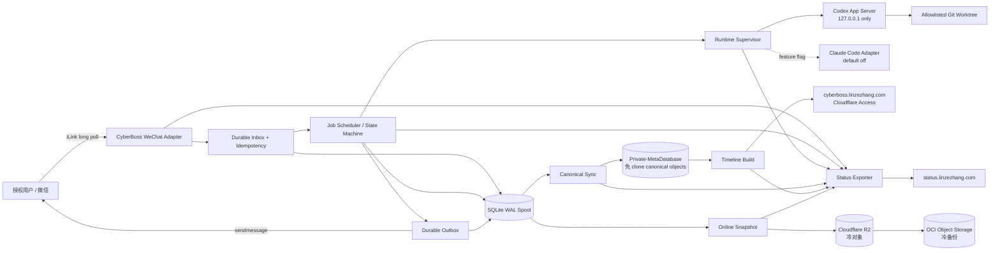

# 03 — 架构、接口、数据、容量、安全与可靠性设计

## 1. 架构决策记录

### ADR-001 — 全云单节点而非 Mac 执行面

**Decision：** CyberBoss、Codex CLI/App Server、项目 worktree、Timeline 和状态输出全部运行在 OVH。
**Reason：** 满足 Mac 关机仍可执行；删除跨机器网络、路径、附件和本地 Connector 复杂度。
**Trade-off：** 单 VPS 不是高可用；通过持久化、
Private-MetaDatabase/R2/OCI 和恢复演练控制风险。

### ADR-002 — 固定导入 CyberBoss/Timeline 内核，原位强化

**Decision：** 从经核验的固定 SHA 一次性导入 CyberBoss、timeline-for-agent
必要源码，保留微信 adapter、runtime 抽象和 Timeline 能力；新增可靠消息层
与云运维。
**Reason：** 24 小时 MVP 不能重写协议和工具。
**Trade-off：** 本地 source bundle 需自行维护；不得保留 upstream remote、
Git URL dependency、自动同步或定期 rebase，未来更新需要 Owner Change Event。

### ADR-003 — SQLite WAL 作为 Runtime Spool

**Decision：** 使用 SQLite WAL 保存 inbox、job、outbox、lease、sync spool；不是 canonical source。
**Reason：** 单用户/单并发、低资源、事务与崩溃恢复足够。
**Trade-off：** 不支持多节点共享写；达到迁移阈值时再升级。

### ADR-004 — Private-MetaDatabase 作为唯一长期事实库

**Decision：** 最终结构化事件和 Timeline 源以脱敏、内容寻址批次通过
`private_db_client.py` 进入 `Private-MetaDatabase`，`domain=CyberBoss`。
**Reason：** 遵循 MetaDatabase 数据铁律，获得审计、恢复与跨 Agent 访问，
同时禁止 clone 大型私有数据仓。
**Trade-off：** 远端 API 不适合作实时事务，必须有本地 spool、幂等 object、
manifest 并发重试和 sync lag 状态。

### ADR-005 — R2 冷对象、OCI 冷备份

**Decision：** R2 保存 SQLite 压缩快照、日志包和未来附件；OCI 周期备份 R2。
**Reason：** 分流 OVH 存储并避免 Git 大对象。
**Trade-off：** 恢复依赖对象清单和 hash 校验。

### ADR-006 — 同机 loopback Runtime transport

**Decision：** Codex App Server 监听 `ws://127.0.0.1:8765`，不经 Cloudflare、不开放公网。
**Reason：** 官方建议本地 transport；最小攻击面。
**Trade-off：** Runtime 与 bridge 同机；单节点故障共享。

### ADR-007 — systemd 优先于容器编排

**Decision：** MVP 采用专用用户 + systemd + immutable release symlink，不引入 Kubernetes/Redis/Postgres。
**Reason：** 资源更轻、进程树和日志更透明、单实例更易保证。
**Trade-off：** 环境隔离不如容器；通过目录权限、cgroup、NoNewPrivileges 和 allowlist 补强。

### ADR-008 — 单并发与 Git Worktree 隔离

**Decision：** 全局 active job=1；mutating task 使用受控 worktree/branch。
**Reason：** OVH 资源余量有限且多任务会放大代码冲突；实时 preflight 决定资源 profile。
**Trade-off：** 吞吐较低，但稳定性和可追踪性更高。

### ADR-009 — 七个核心文件不是交付数量上限

**Decision：** 七个控制文件仅是最低骨架；专项研究、变更地图、预授权、Traceability 与可执行 implementation-kit 均为正式交付。
**Reason：** 硬限制文件数量会把必要实现上下文挤进巨型文档，增加 Agent 检索和冲突成本。
**Guardrail：** 每个补充文件必须可执行或直接降低风险，禁止空 Schema/空台账。

### ADR-010 — 不使用真实时间 Soak 作为发布 Gate

**Decision：** timer、retry、TTL、reminder、check-in、lifecycle 都接受 injectable clock；可靠性以重放、崩溃切点、故障矩阵、请求计数和恢复循环立即验证。
**Reason：** 真实时间流逝不能提高 24 小时内的开发质量，只会阻塞交付。
**Trade-off：** 上线后的真实 uptime 仍持续记录，但只用于运营趋势，不作为本次开发等待条件。

### ADR-011 — 优先使用 Node 内建 SQLite 接口

**Decision：** 目标 Node 版本满足 `node:sqlite` 可用条件时优先使用其同步数据库接口；若上游兼容性或运行环境不满足，再使用锁定版本的轻量 SQLite binding。
**Reason：** 减少 native addon 构建、镜像体积和供应链复杂度。
**Guardrail：** 通过 adapter 隔离 DB driver，SQL schema 与事务语义不绑定具体库。

### ADR-012 — 外部 Provider 写入必须有精确 scope attestation

**Decision：** Cloudflare Access、DNS、R2 和 OCI 的真实写操作必须使用彼此
分离的凭据，并在执行前读取外置 scope attestation；仅凭 token 有效或 GET
成功不得推断写权限最小化。
**Reason：** 当前受保护部署记录可证明多个真实只读能力，但 provider API
不能返回这些 token 的完整权限策略；其中一个 R2/D1 token 还表现出跨
Access、R2、DNS 的读取能力。
**Guardrail：** 宽 account write、额外 write permission、另一个
zone/bucket/prefix、匿名 Access、缺 attestation 全部 fail closed。缺真实
最小权限输入时 adapter/mocks 继续完成，外部状态精确记为
`activation_pending`，不创建全局等待节点。

---

## 2. Context Architecture



---

## 3. Deployment Topology

```text
OVH Singapore VPS-1
├── /opt/cyberboss-cloud/
│   ├── releases/<git-sha>/       immutable application releases
│   ├── current -> releases/<sha> active release
│   └── shared/                   non-secret shared config templates
├── /var/lib/cyberboss/
│   ├── runtime.db                SQLite WAL spool
│   ├── wechat/                   account/session/sync state (0600)
│   ├── timeline-cache/           generated cache, reconstructable
│   ├── canonical-spool/          pending Private-Database event batches
│   ├── snapshots/                short-lived before R2 verification
│   ├── tmp/                      bounded temp
│   └── locks/                    singleton lock
├── /srv/cyberboss-workspaces/
│   ├── cyberboss/             allowlisted clone/worktrees
│   └── ...                       only approved aliases
├── /etc/cyberboss/
│   ├── cyberboss.env             root:cyberboss 0640
│   ├── workspaces.json           aliases, no secrets
│   └── credentials/              root-owned, separate files
├── /var/log/cyberboss/           optional structured app logs; bounded
└── systemd
    ├── cyberboss-cloud.service
    ├── cyberboss-selfheal.service/timer
    ├── cyberboss-backup.service/timer
    └── cyberboss-canonical-sync.service/timer (fallback only)
```

### 3.1 Process Model

Preferred MVP process tree:

```text
systemd: cyberboss-cloud.service
└── node shared-start / cloud entrypoint
    ├── CyberBoss bridge/controller
    ├── Codex app-server child (loopback)
    └── optional static/status HTTP listener (loopback)
```

`KillMode=control-group` ensures a restart kills the entire process family. Application-level lock prevents a second bridge owner even if manual startup is attempted.

### 3.2 Network Exposure

| Port/Path | Bind | Exposure | Protection |
|---|---|---|---|
| Codex App Server `8765` | `127.0.0.1` | Never public | Host loopback only |
| CyberBoss HTTP/status `8780` | `127.0.0.1` | Via existing reverse proxy/Cloudflare | Access for admin/snapshot/timeline |
| `/healthz` | origin route | May be narrowly public or internal probe | No sensitive fields; rate limit |
| `/readyz` | origin route | Prefer private/status collector | No sensitive fields |
| `/status/snapshot.json` | origin route | Access/service-token only | DLP contract |
| `/timeline/` | origin route | Access only | Google/GitHub allowed identity |
| SSH `22` | Host | Existing restricted admin only | key-only, firewall, no password |

Runtime transport is never routed through Cloudflare.

### 3.3 Identity and activation control plane

`implementation-kit/config/identity-scope.policy.json` 是 P0.3 后的机器可读
边界：代码固定为 `LinzeColin/MetaDatabase/CyberBoss` 与 alias
`cyberboss`；数据固定为 `Private-MetaDatabase`、`domain=CyberBoss`，
仅允许 `private_db_client.py ingest/get/list/verify`，禁止 clone/put/delete。

Provider adapter 采用 plan → scope attestation → idempotent reconcile：

```text
Access application/policies
  → private R2 bucket control-plane check
  → Analytics bounded manual item
  → proxied DNS last
```

OCI bucket 名从 root-owned slot 注入，object key 必须位于
`cyberboss-cold-backup/ovh-singapore-vps-1/`。R2 固定 bucket
`cyberboss-cold` 与 `ovh-singapore-vps-1/`。两者均禁止 public、delete
和未经内容一致性核验的 overwrite。

---

## 4. Component Design

### C1 — WeChat Adapter

Reuse upstream. Required changes:

- split `fetch updates` from `commit cursor`;
- return raw update batch with candidate cursor;
- controller transactionally persists each message and dedupe key;
- only after all messages are durable does adapter commit candidate cursor;
- expose `last_poll_attempt`, `last_poll_success`, `last_message_received`, `poll_error_class`;
- send goes through outbox worker, not direct fire-and-forget;
- context token updates are durable and encrypted/permission protected.

### C2 — Durable Inbox

Responsibilities:

- normalize message ID and generate deterministic dedupe key;
- validate user/type/size/command;
- write `inbox_messages`, initial `jobs` and `events` atomically;
- preserve payload only as required for active execution; apply retention after canonical summary;
- expose accepted latency and duplicate-prevented counter.

### C3 — Job State Machine / Scheduler

Responsibilities:

- strict state transition table;
- FIFO by `created_at,id`;
- global single lease with expiry/heartbeat;
- resource gate before dispatch;
- command jobs and Runtime jobs separated;
- mutation jobs carry workspace alias and approval profile;
- retry only if operation is provably safe/idempotent or has not begun mutation.

### C4 — Runtime Supervisor

Responsibilities:

- start/check Codex App Server;
- verify `/readyz` before dispatch;
- monitor auth state without logging credentials;
- create/resume threads;
- map Runtime events to job events;
- capture approval requests;
- enforce max runtime, output limits and cancellation;
- detect process loss and classify retryability;
- expose active job age, last successful turn and model/version.

Claude Code adapter is compiled/installed only if low cost, but dispatch is disabled until `CB_CLAUDE_RUNTIME=true` and release evaluation passes.

### C5 — Workspace Registry

Configuration example:

```json
{
  "schema_version": 1,
  "default_alias": "cyberboss",
  "workspaces": {
    "cyberboss": {
      "repo": "LinzeColin/MetaDatabase",
      "root": "/srv/cyberboss-workspaces/cyberboss",
      "project_subpath": "CyberBoss",
      "read_only": false,
      "max_bytes": 8589934592,
      "allowed_branches": ["main", "codex/cyberboss-*"],
      "sparse_paths": ["CyberBoss", ".github"],
      "write_globs": ["CyberBoss/**"]
    }
  }
}
```

Rules:

- UI/微信只看到 alias；
- root 需位于 `/srv/cyberboss-workspaces/`；
- realpath 校验阻止 symlink escape；
- 每个 mutation job 使用 `git worktree add` 到 bounded job directory；
- 代码变更进入 `codex/cyberboss-*` 本地 branch/worktree；PG-0–PG-5 全部通过
  前禁止 push/PR；
- 只有 Run Contract 明列时才允许触及根级治理集成文件；
- canonical 数据通过独立最小权限 client identity 写入
  `Private-MetaDatabase`；禁止 clone 数据仓。

### C6 — Durable Outbox

Responsibilities:

- result/error/progress message first persisted;
- stable `dedupe_key`；
- send attempt count/next attempt/last error/confirmation；
- jittered exponential backoff；
- context token/auth failures classified terminal or re-login；
- final result can be chunked deterministically；
- process crash can resume pending sends。

### C7 — Canonical Sync

Responsibilities:

- map terminal/important events to append-only canonical records；
- redact/omit private content by default；
- 按 `max_records`、`max_bytes` 或显式 flush 事件批量；终态/高风险 receipt 可立即 flush；测试使用虚拟时钟；
- write deterministic NDJSON/Markdown batches and Timeline source into a
  compressed content-addressed object；
- call `private_db_client.py ingest Private-MetaDatabase <batch>
  --domain CyberBoss`；
- verify object/manifest after upload；409/429 or transient failure refetches
  state and retries idempotently by content/event ID；
- status includes pending count/oldest age/last object hash/last verify；
- never blocks durable inbox for short Private-Database API outages；
- 达到 backlog 条数/字节保护阈值时进入 mutation-stop degraded mode；不得以真实等待时长作为测试 Gate。

### C8 — Timeline Service

Reuse the fixed local `timeline-for-agent` source bundle:

- canonical timeline sources are in `Private-MetaDatabase` objects；
- runtime cache is disposable；
- build triggered after canonical sync with debounce (e.g. 30–120s)；
- serve static output, not dev watcher；
- Access-protected；
- search by static index/client-side filter or SQLite FTS cache；
- screenshot queue only enabled if needed and resource gate passes；
- status page only receives counts/freshness, not entries。

### C9 — Status Exporter

Generates redacted snapshots on state change and by a lightweight runtime timer. Tests invoke the exporter directly and never wait for the timer. It reads local runtime facts and latest remote sync/backup metadata; it never invokes Runtime.

### C10 — Backup / Restore

- online SQLite snapshot using backup API or `VACUUM INTO`；
- include account/session state only in encrypted archive；
- manifest with version, schema, Git commit, SHA-256 and object keys；
- upload to R2 Standard；
- lifecycle retains daily/weekly/monthly tiers；
- OCI mirrors selected weekly/monthly snapshots；
- restore always to isolated path first；
- restoration verifies integrity and canonical event set before promote。

---

## 5. Runtime Database Schema

The executable schema is in `implementation-kit/sql/runtime-spool.sql`. Logical tables:

### 5.1 `inbox_messages`

| Field | Purpose |
|---|---|
| `id` | internal stable ID |
| `source` | `weixin` |
| `source_account_id` | hashed/opaque account ref |
| `source_message_id` | provider stable ID; unique with source/account |
| `user_ref_hash` | HMAC/hash, not raw ID in general logs |
| `context_token_ciphertext` | protected token if required |
| `message_type` | text/command; MVP rejects others |
| `payload_ciphertext` | active content; TTL |
| `payload_sha256` | canonical evidence |
| `received_at` | UTC |
| `durable_at` | transaction commit time |
| `cursor_batch_id` | ordering/recovery |
| `status` | accepted/rejected/consumed |

### 5.2 `jobs`

- stable `id`, correlation, inbox FK；
- workspace alias, runtime, operation class；
- status/version/attempt/lease；
- timestamps；
- result hash/summary/error class；
- canonical sync state；
- no secret fields。

### 5.3 `job_events`

Append-only state transitions and material Runtime events. Payload must be redacted.

### 5.4 `outbox_messages`

- stable dedupe key；
- target/context reference；
- encrypted active payload + hash；
- attempt/next attempt/confirmed at；
- status pending/sending/confirmed/retry/terminal。

### 5.5 `sync_spool`

Canonical event payload prepared for Private-MetaDatabase ingest, retry metadata,
object SHA-256 and manifest verification state.

### 5.6 `service_state`

Current cursor, schema version, last poll/send/E2E, deployed commit, migration and singleton owner metadata.

### 5.7 Retention

| Data | OVH | Private-MetaDatabase | R2 | OCI |
|---|---|---|---|---|
| Active encrypted prompt/result | job + 24h default | No by default | No by default | No |
| Job status/summary/hash | bounded reconstructable cache | append-only canonical; no automatic fact deletion | snapshot | selected snapshot |
| Timeline source | cache | canonical | build snapshots | selected snapshots |
| Logs | size-bounded local ring | only release/incident summary | compressed bundles by retention policy | selected immutable recovery points |
| SQLite snapshots | until verified object upload, then bounded local copies | manifest only | lifecycle-tagged snapshots | selected immutable recovery points |
| WeChat/Codex secrets | live state only, 0600 | Never | encrypted disaster backup only if authorized | encrypted copy only if authorized |

---

## 6. Private-MetaDatabase Canonical Design

Locked canonical location:

```text
LinzeColin/Private-Database@main/
└── Private-MetaDatabase/
    ├── manifest.jsonl
    └── objects/
        └── <sha-prefix>/
            └── <sha256>_<original-name>
```

每个 manifest record 必须包含 `domain=CyberBoss`、稳定 batch/event 范围、
SHA-256、大小、逻辑类型、生成日期和 object path。应用源码、部署脚本、
systemd unit 和运行程序只位于 `LinzeColin/MetaDatabase/CyberBoss/`。
Private-Database 禁止 clone；运行端只使用 `ingest/get/list/verify`。

### 6.1 Canonical Event Minimum Fields

```json
{
  "schema_version": 1,
  "event_id": "evt_...",
  "occurred_at": "2026-07-26T00:00:00Z",
  "recorded_at": "2026-07-26T00:00:02Z",
  "source": "cyberboss-cloud",
  "event_type": "job.succeeded",
  "job_id": "job_...",
  "correlation_id": "corr_...",
  "workspace_alias": "cyberboss",
  "runtime": "codex",
  "input_sha256": "...",
  "output_sha256": "...",
  "summary_redacted": "...",
  "evidence_refs": ["private-db://sha256/...", "r2://..."],
  "deployed_commit": "..."
}
```

No raw token/user ID/full prompt/result.

### 6.2 Conflict Strategy

- event IDs are globally unique and append-only；
- one primary sync worker protected by local lock；
- content-addressed object upload is idempotent by SHA-256；
- manifest optimistic-concurrency conflict triggers refetch/retry and event-ID
  set verification，never last-write-wins；
- duplicate ID with different hash is P0 integrity incident；
- code repo and Private-Database client use separate credentials and policies。

### 6.3 Object Limits

- single client object remains below the client 95 MiB limit；
- event batches are bounded by record count and bytes, then compressed；
- live `.sqlite/.db` files are never ingested directly；online snapshots are
  verified and compressed as `.sqlite3.gz`/`.tar.zst` first；
- large cold binaries use R2 and store only a manifest/hash pointer in
  Private-MetaDatabase。

---

## 7. Status Contract

### 7.1 Snapshot Example

```json
{
  "schema_version": "1.0",
  "generated_at": "2026-07-26T01:02:03Z",
  "service": {
    "name": "cyberboss-cloud",
    "state": "healthy",
    "version": "0.0.0.4",
    "source_commit": "abc1234",
    "deployment": "ovh-singapore",
    "uptime_seconds": 12345
  },
  "wechat": {
    "state": "healthy",
    "last_poll_success_at": "...",
    "poll_age_seconds": 12,
    "last_inbound_at": "...",
    "last_outbound_confirmed_at": "...",
    "outbox_pending": 0,
    "outbox_failed": 0
  },
  "runtime": {
    "selected": "codex",
    "state": "ready",
    "auth_state": "valid",
    "model": "redacted-or-public-model-id",
    "active_job": false,
    "active_job_age_seconds": 0,
    "last_success_at": "..."
  },
  "queue": {
    "queued": 0,
    "running": 0,
    "waiting_approval": 0,
    "oldest_age_seconds": 0
  },
  "canonical": {
    "state": "synced",
    "last_object_sha256": "...",
    "last_verified_at": "...",
    "pending_events": 0,
    "oldest_pending_age_seconds": 0
  },
  "timeline": {
    "last_write_at": "...",
    "last_build_at": "...",
    "entry_count": 123,
    "build_state": "ready"
  },
  "backup": {
    "r2_state": "healthy",
    "r2_last_snapshot_at": "...",
    "oci_state": "not_configured",
    "oci_last_backup_at": null,
    "last_restore_drill_at": "..."
  },
  "resources": {
    "cpu_load_1m": 0.42,
    "memory_used_percent": 61.2,
    "swap_used_percent": 0.0,
    "disk_used_percent": 48.1,
    "inode_used_percent": 12.0
  },
  "self_heal": {
    "last_run_at": "...",
    "last_action": "none",
    "last_result": "ok"
  },
  "degraded_reasons": []
}
```

### 7.2 Status Mapping to Existing Global Page

The read-only CB-010 observation found that the existing `projects[]` row uses
the following exact contract. Internal health fields stay in the private
snapshot/details and must not be substituted for these public fields.

| `projects[]` field | CyberBoss value |
|---|---|
| `name` | CyberBoss Cloud |
| `url` | `https://cyberboss.linzezhang.com` |
| `parts` | `["前台", "后台"]` |
| `host` | OVH Singapore VPS-1 |
| `db` | Private-MetaDatabase + SQLite spool |
| `store` | R2 + OCI |
| `deploy` | systemd immutable release |
| `backup` | R2 snapshots → OCI selected copy |
| `agent` | `中` |
| `notify` | `无` until a real notifier is configured |
| `status` | fresh healthy/degraded Access-protected service → `access`; stale/stopped/not-verified → `down` |

The page contract also recognizes `run`, but CyberBoss must not use it while its
route is Access-protected. Adding the actual row is a later online activation;
CB-010 only validates the adapter fixture.

### 7.3 Health Semantics

- `/healthz`: process/event loop alive and local DB readable；
- `/readyz`: eligible to accept a new job (wechat auth/poll, Runtime ready, disk/RAM gate, singleton, migration)；
- `wechat.poll`: recent successful long poll；
- `wechat.send`: recent confirmed send or no pending send；
- `e2e`: scheduled synthetic command passed；
- global state is the worst severity of required subcomponents, not a simple process status。

---

## 8. Capacity Plan

### 8.1 Adaptive Memory Profiles

Do not hard-code a single memory budget before reading the live OVH baseline. `implementation-kit/scripts/select-resource-profile.sh` deterministically selects one of the following profiles from measured total/available RAM and swap; the generated environment and systemd drop-in become the runtime source of truth.

CB-010 于 2026-07-26 在同一获授权 host 的三次即时 snapshot 上选择
`constrained`：`MemoryHigh=768M`、`MemoryMax=1152M`、`TasksMax=256`、
queue limit 20、memory reserve 512 MiB、disk reserve 4 GiB。该证据只锁定当前
部署候选边界；真正写入 systemd 前仍须重新运行 preflight，若 guard 变为
`protect` 或 reserve 不足则 fail closed。

| Profile | Intended host condition | `MemoryHigh` | `MemoryMax` | Runtime policy |
|---|---|---:|---:|---|
| `constrained` | very limited free RAM; only minimum viable bridge/runtime can fit | 768 MB | 1152 MB | one job, Timeline build and backup serialized, reject only new mutation when protection predicate is true |
| `tiny` | small VPS with limited but usable headroom | 1100 MB | 1600 MB | one job, adaptive cache limits, serialized Git/backup |
| `standard` | measured headroom supports normal Codex operation | 1800 MB | 2600 MB | one job, normal Timeline/build path, still no parallel Runtime |

Shared safeguards for every profile:

- existing OVH services remain outside the CyberBoss cgroup and must not be starved；
- when a finite current or ancestor cgroup v2
  `memory.max`/`memory.swap.max` is lower than host `/proc` capacity, selection
  uses the most restrictive effective ceiling and hierarchy headroom；
- readiness is based on measured available RAM, swap pressure and disk/inode reserve, not elapsed time；
- Codex, Timeline build, Git sync and backup are serialized when the selected profile requires it；
- cache/log/worktree cleanup targets reconstructable data only；
- if no profile can preserve the live host safety reserve, the installer produces an exact remediation report and continues all offline/simulator/code work rather than waiting；only final activation is withheld。

### 8.2 Disk Budget

| Area | Target Cap | Action |
|---|---:|---|
| Application releases | `candidate + current + previous` / ≤1.5 GB | count-based cleanup after candidate promotion and rollback proof |
| Workspaces + worktrees | constrained 4 GB；tiny 8 GB；standard 12 GB | partial/sparse clone, remove completed worktrees |
| Node/npm/Codex caches | ≤2 GB | periodic safe cache cleanup |
| SQLite/state | ≤2 GB | retention/compaction/snapshot |
| Logs | constrained 150 MB；tiny 300 MB；standard 500 MB | journald/app rotation |
| Snapshots/tmp | constrained 512 MB；tiny 1 GB；standard 2 GB | hash-verified upload plus count/size-based cleanup; TTL logic only under virtual-clock tests |
| Host reserve | computed by live preflight | select constrained/tiny/standard profile; clean reconstructable cache; only refuse a new mutation when protect predicate is true |

### 8.3 Throughput

- single active Runtime job；
- queue cap default 100 jobs and a configurable expiry policy；expiry tests use virtual time；
- text input 32 KiB；
- result direct reply cap configurable (e.g. 64–128 KiB) then chunk/protected page；
- canonical object batch by record/byte threshold, explicit terminal flush and provider rate-limit feedback；
- Timeline build is change-driven/debounced; tests trigger it directly without real-time delay；
- backup serialized; if a heavy Runtime job is active, use cgroup/IO controls or snapshot transaction rather than a fixed waiting window。

### 8.4 Migration Triggers

Move beyond SQLite/single-node only if one of these persists:

- >1 concurrent user or required active job concurrency >1；
- queue >1,000/day or write contention；
- SQLite p95 transaction >100ms；
- canonical sync backlog exceeds configured record/byte budget under normal network；
- Runtime and bridge cannot fit with ≥512MB headroom；
- RTO/SLO requires node failover；
- data retention exceeds Git/R2 layout efficiency。

---

## 9. Security Architecture

### 9.1 Trust Zones

1. **Untrusted Channel Zone:** all incoming WeChat text, including authorized user content, may contain prompt injection。
2. **Control Zone:** CyberBoss parser/state machine/queue；no arbitrary shell。
3. **Runtime Zone:** Codex/Claude with allowlisted workspace and approval policy。
4. **Secret Zone:** `/etc/cyberboss/credentials` and Codex auth；not readable by web/static service if split possible。
5. **Canonical Zone:** Private-MetaDatabase no-clone client、脱敏内容寻址记录。
6. **Cold Zone:** R2/OCI objects, encryption and lifecycle。
7. **Presentation Zone:** Cloudflare Access protected Timeline/admin/status。

### 9.2 Authentication and Authorization

- WeChat: explicit allowed user IDs stored as secret/config; hash in ordinary logs；
- Codex: ChatGPT device auth; `~/.codex/auth.json` treated as password, 0600, excluded from backups unless separately encrypted；
- Claude: credentials disabled/unset until feature gate；
- UI: Cloudflare Access with Google/GitHub IdP and narrow email/group policy；
- status collector: Access service token or origin-local fetch；
- GitHub code: final publication only，repo-scoped credential，write only
  `LinzeColin/MetaDatabase`；
- Private-Database data: dedicated service-user `gh` login state used only by
  `private_db_client.py` for `Private-MetaDatabase`；
- R2: bucket-scoped token with object read/write/list only necessary prefix；
- OCI: bucket/namespace policy restricted to backup prefix。

### 9.3 Secret Inventory

| Secret | Location | Rotation/Recovery | Must Never Appear In |
|---|---|---|---|
| WeChat bot bearer/account state | `/var/lib/cyberboss/accounts`, 0600 | re-scan QR | Git/log/status/Timeline |
| Codex auth | dedicated home, 0600 | device-auth again | Git/log/R2 plaintext |
| Claude auth | absent by default | explicit enable | same |
| GitHub code credential | root-protected file/env | revoke/rotate | repo/log |
| Private-Database `gh` login state | dedicated service-user auth store | `gh auth logout/login` | code repo/log |
| R2 key | credentials file | Cloudflare rotate | Git/log/status |
| OCI key/token | credentials file | OCI rotate | Git/log/status |
| HMAC/encryption key | root-only | versioned rotation | any export |
| Cloudflare Access service token | root-only/status collector | rotate | browser source/Git |

### 9.4 Runtime Safety

- no `dangerously-bypass-approvals-and-sandbox` style flags；
- `approval_policy` and sandbox profile explicitly configured；
- deny sensitive paths (`/etc/cyberboss`, Codex auth, SSH keys, system secrets)；
- workspace `realpath` guard；
- mutation class uses branch/worktree/checkpoint；
- user prompt cannot modify system prompt/policy；
- tool output redaction；
- command timeout/output cap；
- no arbitrary package/plugin install without task authorization；
- dangerous irreversible actions are denied or require explicit runtime approval；only that action is blocked, unrelated DAG work continues。

### 9.5 Threat Model

| Threat | Control | Verification |
|---|---|---|
| Unauthorized WeChat user | allowlist before job creation | AC-002 |
| Message replay / duplicate | unique source key, idempotency | AC-023 |
| Cursor crash loss | durable inbox before cursor | AC-004 |
| Duplicate bridge | file/DB lock + systemd cgroup | AC-044 |
| Public Runtime RCE | loopback bind + firewall/scan | AC-011/065 |
| Prompt injection reads secret | deny paths/sandbox/approval/redaction | model red-team suite |
| Workspace escape | alias + realpath + symlink tests | AC-013/014 |
| Secret in logs/status/Git | structured redaction + scanners | AC-033/043/065 |
| Canonical object/manifest overwrite conflict | content hash + append-only IDs + optimistic retry/set verification | AC-032 |
| R2/OCI corruption | SHA-256 manifest + restore drill | AC-051/053 |
| Supply-chain compromise | pin SHA/lockfile, dependency scan, SBOM | release gate |
| AGPL non-compliance | source offer/modification notice | AC-069 |
| Resource DoS | size/queue/rate/resource gates | AC-006/064 |

### 9.6 Security Assurance Lifecycle

- Design: threat model, trust zones, data inventory；
- Build: lockfile, pinned upstream commit, least privilege, code review；
- Test: SAST, dependency audit, secret scan, port/workspace/prompt-injection tests；
- Release: SBOM, signed/tagged commit where available, Access/firewall check；
- Maintain: dependency update cadence, auth expiry monitoring, incident/rotation runbook；
- Rollback: previous release symlink, no destructive migration。

---

## 10. Reliability and Self-healing

### 10.1 Failure Classes

| Failure | Automatic Action | Escalation Predicate（不阻塞其他 DAG） |
|---|---|---|
| Bridge process crash | systemd immediate restart with bounded burst control | restart budget exhausted |
| Codex not ready | restart process family; preserve/hold queue | auth invalid or repeated deterministic probe failure |
| WeChat poll stale | reconnect/restart adapter | auth/account error or probe remains failed after retry budget |
| Outbox transient error | virtual-clock-tested bounded backoff | retry budget exhausted |
| Private-Database API unavailable | retain sync spool, degraded | backlog record/byte protect threshold reached |
| Timeline build failure | retain prior static build, retry on next explicit trigger | consecutive failure budget exhausted |
| Disk pressure | stop builds, GC verified reconstructable data, protect mutation | protect threshold remains true after safe GC |
| RAM pressure | stop nonessential work, reject new heavy job | OOM or protect predicate remains true |
| Corrupt SQLite | stop mutation, snapshot evidence, restore isolated | promotion requires integrity/reconcile Oracle |
| R2 unavailable | retain bounded local snapshot and manifest | local snapshot quota reached |

所有故障测试通过直接注入、mock provider、虚拟时钟和重复执行完成；不得等待真实分钟、小时或天数。

### 10.2 Self-heal Guardrails

- deterministic shell/Node only；
- no LLM call；
- no source code changes；
- no destructive data deletion unless object is verified synced and TTL/manifest permits；
- max action count and injectable-clock cooldown；
- every action in journal/status；
- repeated failure escalates, does not loop infinitely；
- self-heal itself checked by separate timer/status freshness。

### 10.3 Singleton

Use two layers:

1. systemd unit as intended single owner；
2. application startup obtains `flock`/SQLite lease with PID + boot ID + timestamp；
3. if a live owner exists, second process exits non-zero；
4. stale lock only reclaimed after PID/boot/heartbeat proof；
5. startup command never silently spawns unmanaged duplicate bridges。

---

## 11. Backup and Recovery Architecture

### 11.1 Recovery Objectives

| Asset | Durability / Recovery Objective | Immediate Verification | Source |
|---|---|---|---|
| Durable inbox/outbox | committed transaction RPO 0 across crash cut-points | crash matrix + reopen/integrity query | local WAL |
| Terminal job/history | every canonical event eventually reconciles without overwrite | Private-Database outage/409/429 replay set diff=0 | Private-MetaDatabase |
| Timeline | rebuild from canonical source and match event/index hashes | clean-directory rebuild loop | Private-MetaDatabase + build |
| Runtime/account state | encrypted export only when explicitly approved; reauth path documented | isolated decrypt/format check or `activation_pending` | R2 + reauth |
| Cold backup | R2 object and OCI replica manifest/hash match | mock + real adapter verification when credential exists | R2 / OCI |

这些目标不要求等待任何真实备份周期；开发验收按 on-demand backup/restore 和故障注入立即完成。运行时仍可按策略定期执行，但周期不是发布 Gate。

### 11.2 Backup Set

- `runtime.db` consistent snapshot；
- schema/migration version；
- encrypted WeChat session state only if approved；
- public/non-secret workspace alias config；
- deployed commit and lockfile hash；
- canonical object/manifest hash；
- Timeline build hash；
- manifest and SHA-256；
- **exclude** npm cache, worktrees, logs beyond selected bundle, Codex auth plaintext。

### 11.3 Restore Sequence

1. Create isolated restore directory；
2. unpack exact local code release artifact/commit；
3. use `private_db_client.py get/list/verify` to fetch required canonical objects；
4. download R2 snapshot and verify manifest/hash；
5. SQLite `integrity_check`；
6. reconstruct state/index/Timeline；
7. run service with network/send disabled；
8. compare event/job/timeline counts and hashes；
9. run health/ready/read-only tests；
10. promotion policy predicate 通过后立即以 symlink 切换；
11. reauthenticate WeChat/Codex if secrets excluded；
12. record restore evidence。

---

## 12. Migration from Upstream CyberBoss

### Step 1 — Pin and Baseline

- record upstream tag/version and exact SHA；
- run original local or staging chain once；
- capture behavior of login, poll, send, Codex, Timeline；
- do not modify before baseline evidence。

### Step 2 — Cloud Filesystem and Service

- create dedicated user/dirs/env；
- unpack the fixed local source bundle and install the lockfile dependencies；
- device auth + QR login；
- systemd single process family；
- loopback endpoints。

### Step 3 — Reliable Messaging Patch

- adapter candidate cursor API；
- durable inbox transaction；
- unique indexes；
- outbox/retry；
- singleton；
- state migration additive。

### Step 4 — Canonical/Timeline/Status

- Private-MetaDatabase no-clone sync worker；
- Timeline source/build；
- status snapshot；
- R2 backup；
- global status adapter。

### Step 5 — Release

- test/chaos/security/model eval；
- feature flags off by default；
- immutable candidate release + atomic symlink promotion；
- deterministic canary probes；
- promote/rollback evidence。

---

## 13. API and Internal Protocol Contracts

### 13.1 HTTP

| Method | Path | Auth | Semantics |
|---|---|---|---|
| GET | `/healthz` | origin/internal or public minimal | process and DB liveness |
| GET | `/readyz` | internal/Access | eligible for new jobs |
| GET | `/status/snapshot.json` | Access service token | redacted detailed snapshot |
| GET | `/timeline/` | Cloudflare Access | static Timeline UI |
| GET | `/timeline/search-index.json` | Access | redacted static index |
| POST | `/internal/e2e-probe` | localhost/service token | deterministic synthetic test only |

No public job submission HTTP API in MVP; WeChat is the product channel.

### 13.2 Internal Event Envelope

```json
{
  "schema_version": 1,
  "event_id": "evt_ulid",
  "event_type": "job.running",
  "occurred_at": "UTC ISO-8601",
  "correlation_id": "corr_ulid",
  "job_id": "job_ulid",
  "payload": {},
  "redaction_version": 1
}
```

### 13.3 Error Taxonomy

- `AUTH_WECHAT_INVALID`
- `AUTH_CODEX_INVALID`
- `CHANNEL_POLL_TRANSIENT`
- `CHANNEL_SEND_TRANSIENT`
- `CHANNEL_SEND_TERMINAL`
- `INPUT_UNAUTHORIZED`
- `INPUT_TOO_LARGE`
- `WORKSPACE_UNKNOWN`
- `WORKSPACE_ESCAPE`
- `RESOURCE_MEMORY_PRESSURE`
- `RESOURCE_DISK_PRESSURE`
- `RUNTIME_NOT_READY`
- `RUNTIME_TURN_FAILED_RETRYABLE`
- `RUNTIME_TURN_FAILED_TERMINAL`
- `RUNTIME_CANCELLED`
- `CANONICAL_SYNC_TRANSIENT`
- `CANONICAL_INTEGRITY_CONFLICT`
- `BACKUP_UPLOAD_FAILED`
- `RESTORE_INTEGRITY_FAILED`

Every error has retryability, user-facing text, status severity and required evidence mapping.

---

## 14. Feature Flags

| Flag | MVP Default | Purpose | Enable Gate |
|---|---:|---|---|
| `CB_DURABLE_INBOX` | true | durable-before-cursor | mandatory |
| `CB_DURABLE_OUTBOX` | true | reliable send | mandatory |
| `CB_GITHUB_CANONICAL_SYNC` | true | unique hot facts | mandatory |
| `CB_TIMELINE_WEB` | true | Access-protected read-only Timeline | AC-035 |
| `CB_STATUS_EXPORTER` | true | global status integration | AC-046 |
| `CB_R2_SNAPSHOT` | true | cold snapshot | AC-051 |
| `CB_OCI_BACKUP` | false until configured | backup-of-backup | AC-052 |
| `CB_CLAUDE_RUNTIME` | false | alternate runtime | full dual eval |
| `CB_FILE_ATTACHMENTS` | false | attachments | Phase 2 |
| `CB_STORE_FULL_CONTENT` | false | encrypted content archive | privacy review |
| `CB_AUTONOMOUS_MUTATION` | false | broad unsupervised mutation | production safety gate |

---


## 15. No-Wait / Testability Contract

- 所有 clock access 通过 `Clock` interface 注入；生产使用 system clock，测试使用 deterministic fake clock。
- Retry scheduler、TTL、job expiry、reminder、check-in、backup lifecycle、status freshness 均不得直接散落 `Date.now()` + `setTimeout()`；统一进入 scheduler/clock adapter。
- deploy/rollback/restore 脚本禁止固定 `sleep N`；使用 bounded predicate loop，条件满足立即继续，失败立即输出证据。
- Canary 以请求集合和风险等级划分：只读 synthetic、可逆 mutation、故障恢复；完成请求即判定，不按分钟/小时等待。
- 缺失外部 credential 时使用 provider simulator 完成所有可完成测试，并把真实 adapter 状态标记 `activation_pending`；不得形成全局 waiting node。
- CI 扫描任务包和实现，禁止 `soak` Gate、7/30 天观察 Gate、固定长 sleep、凭据等待任务和无 Oracle 的“观察”。

---

## 16. Residual Risks


1. 微信 iLink 是外部能力，账号/地区/接口变化可能中断；MVP 无法消除，只能检测和预留 adapter replacement。
2. Codex device auth/token refresh 是外部能力；需状态监控与 reauth runbook。
3. 单 OVH 节点存在 host/region outage；Private-MetaDatabase/R2/OCI 保证恢复，不保证无中断。
4. Private-MetaDatabase API 作为 canonical ledger 的写延迟受外部网络影响；degraded mode 是必要边界。
5. Agent 处理不可信仓库/文本存在模型侧风险；双流水线和 sandbox 降低但不能证明零风险。
6. 实时资源可能因具体项目依赖而不足；live preflight 选择 constrained/tiny/standard
   profile，若单 Runtime 仍无法共存，则只否决同机 Runtime 路线并输出升级/拆分证据。
7. 固定 source bundle 不自动跟随上游；未来更新必须由 Owner Change Event
   批准新 SHA、许可证重审和一次性导入。
