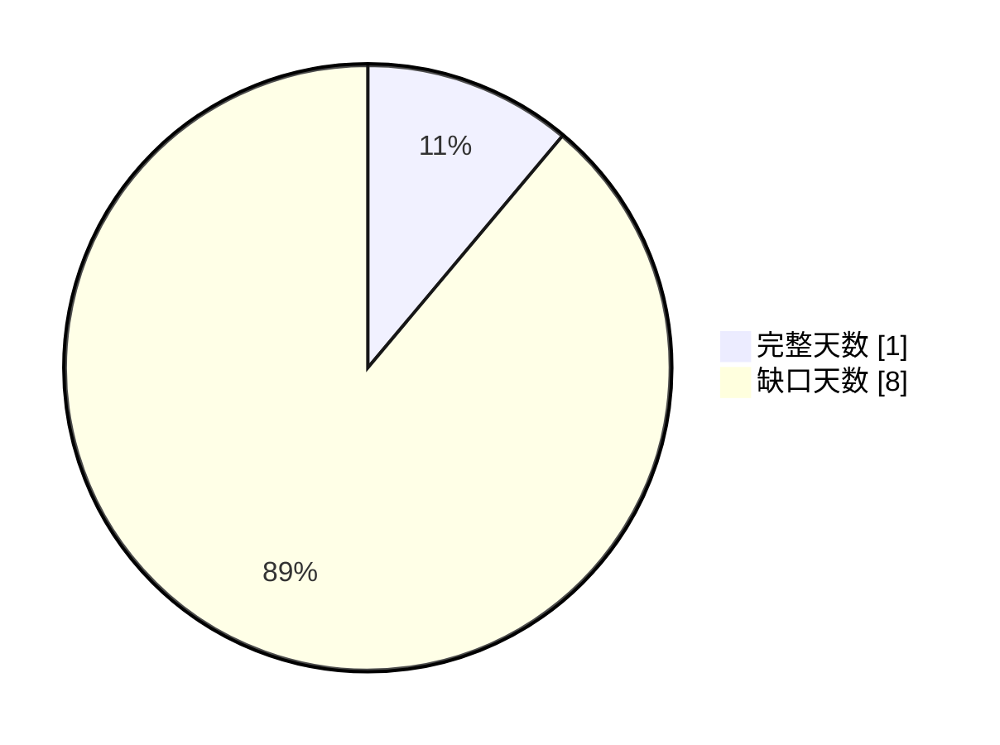

# TAB FIFA 主动测试时间线 Dashboard

本报告检查 automation cadence：每天至少四次分析、每天一份正式日报，并给出补跑优先级。它只生成研究与补跑报告，不自动下注。

## Executive Summary

- status: `blocked`
- ready_for_recurring_automation: `False`
- checked days: `9`
- complete days: `1`
- missing analysis days: `5`
- missing report days: `8`
- backfill queue: `8`
- recovery_plan_status: `blocked_by_raw_refresh`
- safe_to_backfill_now: `False`
- partial_daily_research: `ready_research_only` / ready `True` / stake `AUD 0`
- primary_gap: `公开盘口 raw 未就绪`
- recommended_next_action: 先接入授权 raw 或导入用户导出快照；成功后主动测试才能安全补跑缺失日期。

## Visual Summary

## 补缺恢复计划

- status: `blocked_by_raw_refresh`
- raw_status: `blocked`
- blocked_queue_count: `8`
- next_unlock_action: 先接入授权 raw 或导入用户导出快照；raw 通过后按日期优先级补跑，补跑过程不发布 latest_commit。
- safety_boundary: 只生成研究报告和补跑审计，不自动下注、不点击赔率、不加入投注单；raw/private 门禁失败时新下注金额保持 AUD 0。

| 顺序 | 日期 | 分数 | 缺口 | 动作 | 模式 |
|---:|---|---:|---|---|---|
| 1 | 07/06/2026 | 160 | 有效分析 0/4；Downloads 正式日报缺失 | 等待 raw 刷新后补跑 | safe_no_latest_publish |
| 2 | 08/06/2026 | 160 | 有效分析 0/4；Downloads 正式日报缺失 | 等待 raw 刷新后补跑 | safe_no_latest_publish |
| 3 | 09/06/2026 | 160 | 有效分析 0/4；Downloads 正式日报缺失 | 等待 raw 刷新后补跑 | safe_no_latest_publish |
| 4 | 10/06/2026 | 160 | 有效分析 0/4；Downloads 正式日报缺失 | 等待 raw 刷新后补跑 | safe_no_latest_publish |
| 5 | 11/06/2026 | 160 | 有效分析 0/4；Downloads 正式日报缺失 | 等待 raw 刷新后补跑 | safe_no_latest_publish |
| 6 | 06/06/2026 | 75 | Downloads 正式日报缺失 | 等待 raw 刷新后补跑 | safe_no_latest_publish |
| 7 | 12/06/2026 | 75 | Downloads 正式日报缺失 | 等待 raw 刷新后补跑 | safe_no_latest_publish |
| 8 | 13/06/2026 | 75 | Downloads 正式日报缺失 | 等待 raw 刷新后补跑 | safe_no_latest_publish |

## 研究诊断日报补写

| 状态 | Ready | 来源 | PDF | 日期版 PDF | 执行金额 | 用途 |
|---|---:|---|---|---|---:|---|
| ready_research_only | 是 | active_backfill_latest.partial_daily_research | partial_daily_research_latest.pdf | 13062026_partial_daily_research.pdf | AUD 0 | raw blocked 时用于每日 research-only 诊断补写；不能替代正式日报，不能解锁新增下注。 |

## 每日时间线

| 日期 | 状态 | 有效分析 | 覆盖时段 | 缺失时段 | 日报 | 补跑原因 |
|---|---|---:|---:|---:|---|---|
| 05/06/2026 | 完整 | 8/4 | 3 | 2 | 有 | 无需补跑 |
| 06/06/2026 | 缺口 | 7/4 | 2 | 3 | 缺 | Downloads 正式日报缺失 |
| 07/06/2026 | 缺口 | 0/4 | 0 | 5 | 缺 | 有效分析 0/4；Downloads 正式日报缺失 |
| 08/06/2026 | 缺口 | 0/4 | 0 | 5 | 缺 | 有效分析 0/4；Downloads 正式日报缺失 |
| 09/06/2026 | 缺口 | 0/4 | 0 | 5 | 缺 | 有效分析 0/4；Downloads 正式日报缺失 |
| 10/06/2026 | 缺口 | 0/4 | 0 | 5 | 缺 | 有效分析 0/4；Downloads 正式日报缺失 |
| 11/06/2026 | 缺口 | 0/4 | 0 | 5 | 缺 | 有效分析 0/4；Downloads 正式日报缺失 |
| 12/06/2026 | 缺口 | 4/4 | 2 | 3 | 缺 | Downloads 正式日报缺失 |
| 13/06/2026 | 缺口 | 9/4 | 2 | 3 | 缺 | Downloads 正式日报缺失 |

## 时段覆盖

| 时段 | 覆盖天数 | 缺失天数 | 覆盖率 | 状态 |
|---|---:|---:|---:|---|
| 00:00-05:00 | 1 | 8 | 11.11% | 缺口 |
| 05:00-10:00 | 2 | 7 | 22.22% | 缺口 |
| 10:00-15:00 | 2 | 7 | 22.22% | 缺口 |
| 15:00-20:00 | 2 | 7 | 22.22% | 缺口 |
| 20:00-24:00 | 2 | 7 | 22.22% | 缺口 |

## 补跑优先队列

| 顺序 | 日期 | 分数 | 缺口 | 排序依据 | 模式 |
|---:|---|---:|---|---|---|
| 1 | 07/06/2026 | 160 | 有效分析 0/4；Downloads 正式日报缺失 | 缺失时段 5/5；有效分析 0/4；日报缺失；latest=missing | safe_no_latest_publish |
| 2 | 08/06/2026 | 160 | 有效分析 0/4；Downloads 正式日报缺失 | 缺失时段 5/5；有效分析 0/4；日报缺失；latest=missing | safe_no_latest_publish |
| 3 | 09/06/2026 | 160 | 有效分析 0/4；Downloads 正式日报缺失 | 缺失时段 5/5；有效分析 0/4；日报缺失；latest=missing | safe_no_latest_publish |
| 4 | 10/06/2026 | 160 | 有效分析 0/4；Downloads 正式日报缺失 | 缺失时段 5/5；有效分析 0/4；日报缺失；latest=missing | safe_no_latest_publish |
| 5 | 11/06/2026 | 160 | 有效分析 0/4；Downloads 正式日报缺失 | 缺失时段 5/5；有效分析 0/4；日报缺失；latest=missing | safe_no_latest_publish |
| 6 | 06/06/2026 | 75 | Downloads 正式日报缺失 | 缺失时段 3/5；有效分析 7/4；日报缺失；latest=blocked_by_gate | safe_no_latest_publish |
| 7 | 12/06/2026 | 75 | Downloads 正式日报缺失 | 缺失时段 3/5；有效分析 4/4；日报缺失；latest=blocked_by_gate | safe_no_latest_publish |
| 8 | 13/06/2026 | 75 | Downloads 正式日报缺失 | 缺失时段 3/5；有效分析 9/4；日报缺失；latest=blocked_by_gate | safe_no_latest_publish |

## 新旧对比

| 指标 | 当前 | 上次 | 变化 | 方向 |
|---|---:|---:|---:|---|
| 完整天数 | 1 | 1 | +0 | 持平 |
| 分析缺口日 | 5 | 5 | +0 | 持平 |
| 日报缺口日 | 8 | 8 | +0 | 持平 |
| 补跑队列 | 8 | 8 | +0 | 持平 |

> 历史补跑只能用当前可用数据重建，不能冒充原时点盘口；raw 或门禁失败时保持 fail-closed。