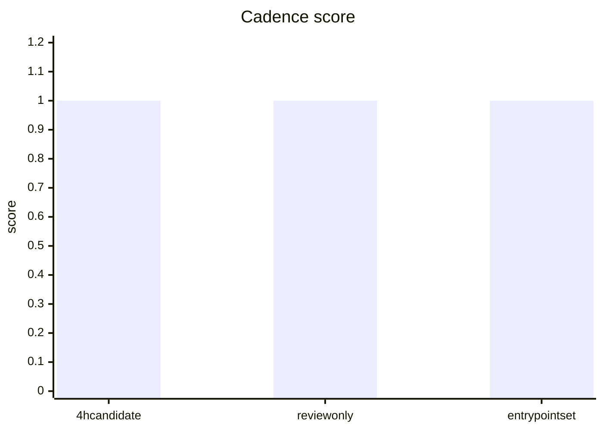
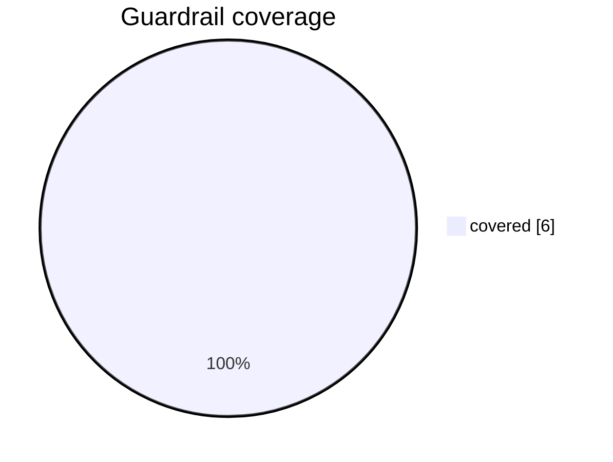
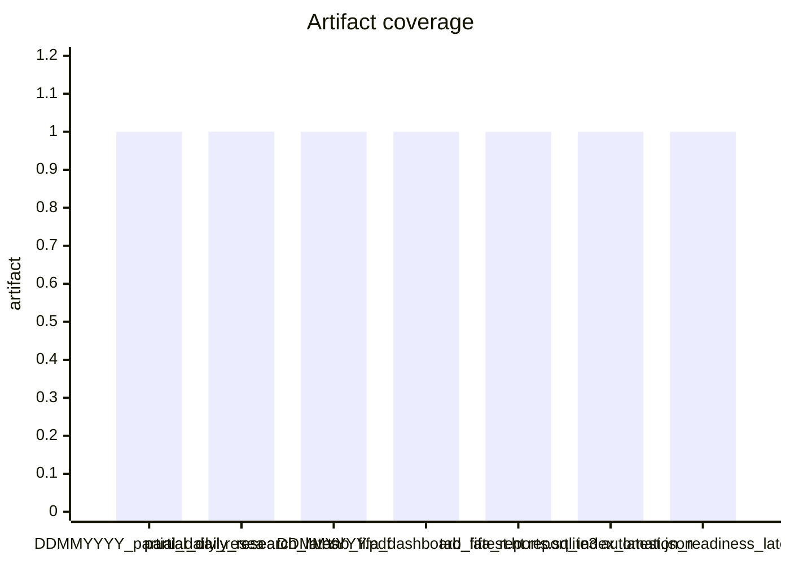
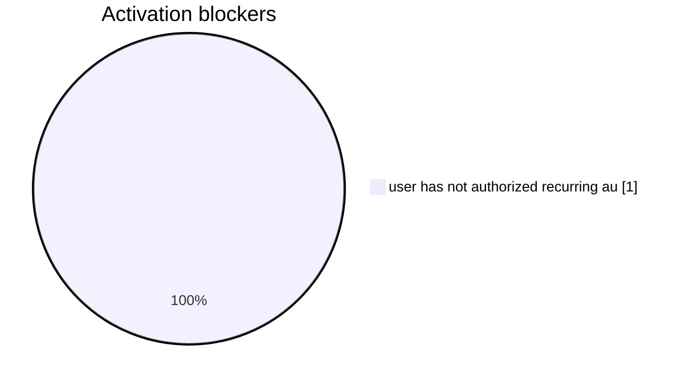

# TAB FIFA Automation Candidate

本文件是授权前候选调度包：它描述 recurring 报告生成如何运行，但不安装调度、不登录下注、不执行任何下注动作。

## Executive Status

- status: `review_required_not_installed`
- candidate_ready: `True`
- installed: `False`
- recommended_cadence: `4h`
- timezone: `Australia/Sydney`
- rrule: `FREQ=HOURLY;INTERVAL=4`
- entrypoint: `scripts/run_tab_fifa_daily_automation.sh --allow-research-only-success`

## Visual Summary

### Cadence score

### Guardrail coverage

### Artifact coverage

### Activation blockers

## Required Gates

| Gate | Required Evidence | Fail Closed |
|---|---|---|
| research-only daily PDF | partial_daily_research_latest.json ready, fresh, public-safe, execution stake AUD 0 | `True` |
| fresh TAB raw | raw_refresh_latest.json reports all required boards fresh | `True` |
| private position snapshot | current-day private position snapshot parsed without unknown statuses | `True` |
| PDF QA | pdf_qa_latest.json reports required terms and minimum text/page/size | `True` |
| public artifact safety | public artifact scan has zero private detail or local path markers | `True` |
| latest pointer consistency | latest_commit and report_index latest_success_run_id match | `True` |
| user authorization | config/automation.toml explicitly authorizes recurring report generation only | `True` |

## Guardrails

- `report_only`: 只生成本地研究报告、dashboard、SQLite记录和新旧对比。
- `research_only_daily_allowed`: 正式 raw/private 不完整时，允许生成 research-only 诊断日报；新增执行金额固定 AUD 0。
- `no_auto_wagering`: 禁止自动下注、禁止自动提交任何投注指令。
- `fresh_data_required`: TAB raw 超过 freshness gate 时拒绝发布正式日报。
- `private_position_required`: 需要当日私有持仓快照才能更新真实持仓和收益率。
- `latest_pointer_fail_closed`: 失败 run 不覆盖 latest_commit.json。

## Expected Artifacts

- `DDMMYYYY_partial_daily_research.pdf`
- `partial_daily_research_latest.pdf`
- `partial_daily_research_latest.json`
- `DDMMYYYY.pdf`
- `tab_fifa_dashboard_latest.html`
- `tab_fifa_reports.sqlite3`
- `report_index_latest.json`
- `automation_readiness_latest.json`
- `tab_fifa_model_comparison_v0_1.pdf`

## Review Actions

- 保持候选包 review-only；未授权前不创建 recurring automation。
- 确认 4 小时 cadence 是否符合你的正式运行节奏。
- 授权时只允许 report_generation_only，auto_wagering_allowed 必须保持 false。