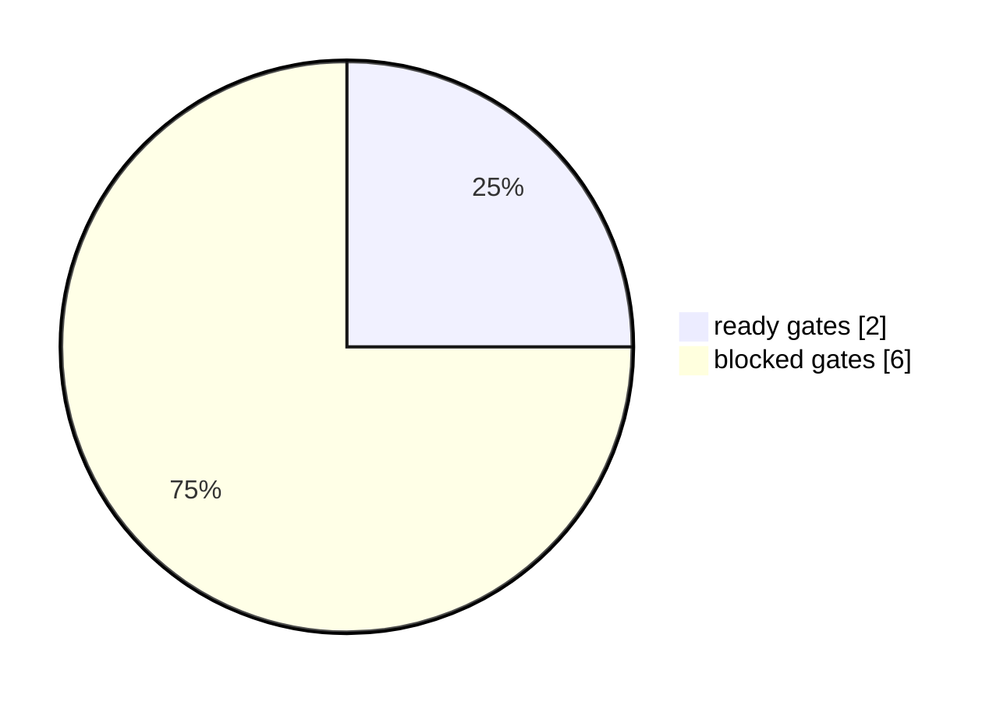

# TAB FIFA Automation Doctor Dashboard

本报告给出进入每日自动化前的本地诊断和命令队列。它只生成报告与诊断，不自动下注。

## Executive Summary

- ready_to_enter_recurring_automation: `False`
- formal_report_publish_ready: `False`
- recurring_automation_ready: `False`
- trusted_report_date: `04062026`
- primary_blocker: 公开盘口 raw 不新鲜或不可用
- summary_decision: 暂不进入每日自动化：公开盘口 raw 不新鲜或不可用；下一步 刷新公开盘口 raw。

## Summary For Aggregation

| 指标 | 值 |
|---|---:|
| automation_entry_status | blocked |
| readiness_score | 25.00% |
| required gates | 2/8 |
| P0/P1 blockers | 3/2 |
| raw_refresh_status | blocked |
| private_position_status | profile_login_required |
| missing analysis/report days | 5/8 |
| backfill queue | 8 |
| next_best_action | 刷新公开盘口 raw |

## Automation Doctor Dashboard

- 入场判断：`暂不进入每日自动化`
- 入场门禁得分：`25.00%`
- P0 阻塞：`3`；P1 阻塞：`2`
- 下一步动作：`刷新公开盘口 raw`
- 修复焦点：优先补齐日期：07/06/2026(5)、08/06/2026(5)、09/06/2026(5)；重点时段：00-05(8)、15-20(7)、20-24(7)。

| Dashboard 指标 | 值 |
|---|---:|
| required gate ready | 2/8 |
| P0 commands | 3 |
| backfill queue | 8 |
| raw status | blocked |
| private position | profile_login_required |

## Gate Matrix

| Gate | Status | Required | Evidence |
|---|---|---:|---|
| 可信最新报告 | ready | 1 | latest_commit.json 可用且公开安全 |
| 公开盘口 freshness | blocked | 1 | TAB 当前导航未列出该板块或深链路由到其他板块；先重新发现 Soccer live board list，若仍缺失则将该板块标记为 temporarily unavailable review queue，不用旧盘口生成建议。 |
| 私有持仓快照 | blocked | 1 | 建立或刷新 TAB 专用已登录 profile：`TAB_FIFA_HEADLESS=0 node scripts/capture_tab_my_bets_readonly.mjs --report-date 13062026 --wait-for-login-ms 600000`。 |
| 当前日报发布门禁 | blocked | 1 | formal report publish gate |
| 主动测试节奏 | blocked | 1 | 每日 4 次分析且 1 份日报 |
| 公开产物安全 | ready | 1 | public-safety gate |
| 技术预检 | blocked | 1 | technical preflight publication_clear |
| 研究智能层 | ready | 0 | report intelligence latest bundle |
| 调度候选配置 | ready | 0 | review_required_not_installed |
| 用户调度授权 | blocked | 1 | 未授权前保持手动报告生成 |

## Command Queue

| 优先级 | 动作 | 命令 | 效果 | 需要人在场 |
|---|---|---|---|---:|
| P0 | 刷新公开盘口 raw | `TAB_FIFA_HEADLESS=0 python3 run_daily_report.py` | 只读刷新公开盘口；若私有持仓仍缺失，日报会 fail-closed。 | 0 |
| P0 | 建立私有持仓读取 profile | `TAB_FIFA_HEADLESS=0 node scripts/capture_tab_my_bets_readonly.mjs --report-date 13062026 --wait-for-login-ms 600000` | 打开本地只读 capture 窗口，用户完成 TAB 授权后保存私有 raw text；不保存密码、不下注。 | 1 |
| P0 | 导入私有持仓快照 | `python3 import_my_bets_snapshot.py --source <private_raw_text_13062026.txt> --report-date 13062026` | 把私有 raw text 转成 private snapshot，供 technical preflight 使用。 | 0 |
| P1 | 补齐主动测试缺口 | `python3 scripts/app_backfill_worker.py --max-backfill-runs 3` | 安全补跑缺失日报/分析并刷新 Downloads app；不会发布 latest。优先补齐日期：07/06/2026(5)、08/06/2026(5)、09/06/2026(5)；重点时段：00-05(8)、15-20(7)、20-24(7)。 | 0 |
| P1 | 重跑正式日报 | `TAB_FIFA_REFRESH_RAW=reuse_fresh python3 run_daily_report.py` | 在 raw 与私有持仓都就绪后生成正式中文 PDF、入库、对比旧报告并更新 latest。 | 0 |
| P1 | 复核 automation readiness | `scripts/run_tab_fifa_daily_automation.sh --verify-only` | 跑 hermetic verifier 与 readiness sidecars，确认进入调度前的离线门禁。 | 0 |
| P2 | 刷新本地入口 | `python3 scripts/build_downloads_app_entry.py` | 复制最新公开资产到 Downloads app。 | 0 |

## Blockers

| 优先级 | 阻塞 | 影响 |
|---|---|---|
| P0 | 公开盘口 raw 不新鲜或不可用 | 先完成只读公开盘口刷新，再允许生成当日正式报告。 |
| P0 | 私有持仓快照缺失 | 完成本地只读私有持仓 capture/import，之后重跑日报。 |
| P0 | 当前 attempted run 未过发布门禁 | 修复 P0 阻塞后重跑日报，不推进 latest 成功指针。 |
| P1 | 主动测试存在缺口 | 优先补齐日期：07/06/2026(5)、08/06/2026(5)、09/06/2026(5)；重点时段：00-05(8)、15-20(7)、20-24(7)。 补跑不发布 latest。 |
| P1 | 调度入口尚未进入 ready 状态 | 在所有技术门禁通过后再等待用户授权 recurring automation。 |

## 修复优先级趋势

- 历史审计次数：`12`
- 最新完整率：`11.11%`
- 最新缺口数：`13`
- 趋势方向：`deteriorating`
- 修复焦点：优先补齐日期：07/06/2026(5)、08/06/2026(5)、09/06/2026(5)；重点时段：00-05(8)、15-20(7)、20-24(7)。

| 补跑顺序 | 日期 | 分数 | 原因 | 排序依据 |
|---:|---|---:|---|---|
| 1 | 07/06/2026 | 160 | 有效分析 0/4；Downloads 正式日报缺失 | 缺失时段 5/5；有效分析 0/4；日报缺失；latest=missing |
| 2 | 08/06/2026 | 160 | 有效分析 0/4；Downloads 正式日报缺失 | 缺失时段 5/5；有效分析 0/4；日报缺失；latest=missing |
| 3 | 09/06/2026 | 160 | 有效分析 0/4；Downloads 正式日报缺失 | 缺失时段 5/5；有效分析 0/4；日报缺失；latest=missing |
| 4 | 10/06/2026 | 160 | 有效分析 0/4；Downloads 正式日报缺失 | 缺失时段 5/5；有效分析 0/4；日报缺失；latest=missing |
| 5 | 11/06/2026 | 160 | 有效分析 0/4；Downloads 正式日报缺失 | 缺失时段 5/5；有效分析 0/4；日报缺失；latest=missing |

| 缺失时段 | 缺失次数 |
|---|---:|
| 00-05 | 8 |
| 15-20 | 7 |
| 20-24 | 7 |
| 05-10 | 6 |
| 10-15 | 6 |

| 缺失日期 | 缺失时段数 | 有效分析 | 日报 | 原因 |
|---|---:|---:|---|---|
| 07/06/2026 | 5 | 0 | 缺失 | 有效分析 0/4；Downloads 正式日报缺失 |
| 08/06/2026 | 5 | 0 | 缺失 | 有效分析 0/4；Downloads 正式日报缺失 |
| 09/06/2026 | 5 | 0 | 缺失 | 有效分析 0/4；Downloads 正式日报缺失 |
| 10/06/2026 | 5 | 0 | 缺失 | 有效分析 0/4；Downloads 正式日报缺失 |
| 11/06/2026 | 5 | 0 | 缺失 | 有效分析 0/4；Downloads 正式日报缺失 |

## old_new_compare / 新旧诊断变化

- compare_status: `compared_with_previous_artifact`
- previous_generated_at: `2026-06-13T14:36:16.169375+10:00`
- changed_count: `0/11`
- summary: 0/11 个关键指标发生变化。

| 指标 | 当前 | 上一版 | 变化 |
|---|---:|---:|---:|
| ready_to_enter_recurring_automation | false | false | 0 |
| formal_report_publish_ready | false | false | 0 |
| recurring_automation_ready | false | false | 0 |
| primary_blocker | 公开盘口 raw 不新鲜或不可用 | 公开盘口 raw 不新鲜或不可用 | 0 |
| readiness_score | 0.25 | 0.25 | 0 |
| required_gate_ready_count | 2 | 2 | 0 |
| p0_blocker_count | 3 | 3 | 0 |
| p1_blocker_count | 2 | 2 | 0 |
| backfill_queue_count | 8 | 8 | 0 |
| raw_status | blocked | blocked | 0 |
| private_position_status | profile_login_required | profile_login_required | 0 |