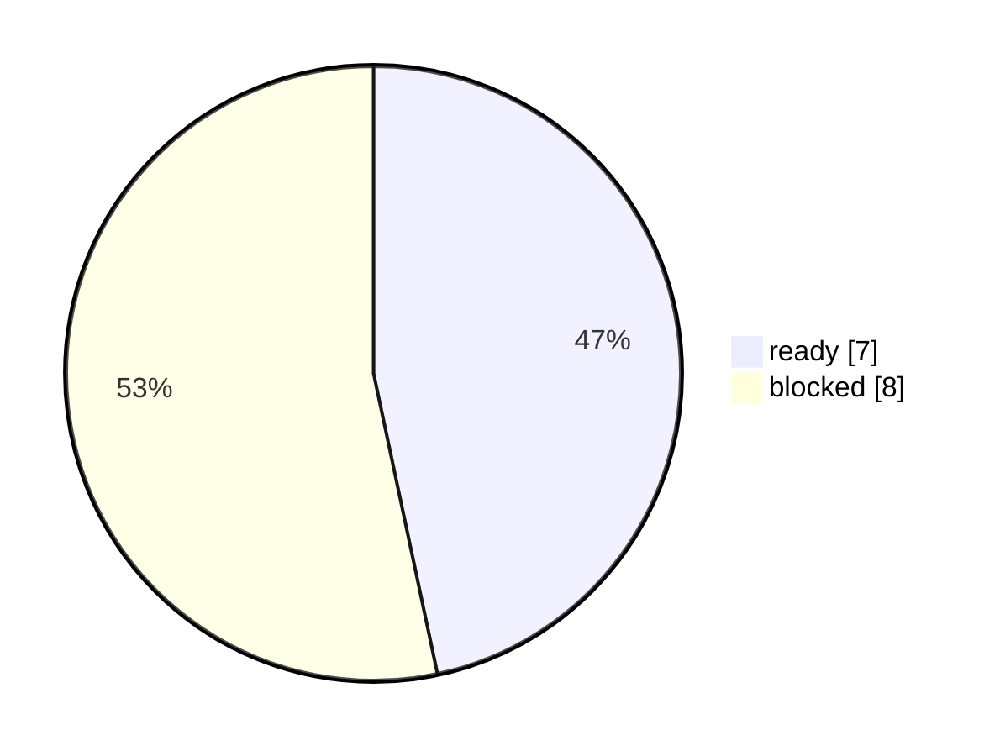

# TAB FIFA Automation 成熟度验收矩阵

本报告把用户目标拆成可验证验收项：自动爬虫、4小时节奏、每日PDF、本地数据库、新旧对比、图表/Dashboard、GitHub模型参考、下注推荐首页、持仓监控、fail-closed、安全边界和调度授权。

## Executive Summary

- automation_ready: `False`
- status: `blocked`
- overall_score: `46.67%`
- required_ready: `7/15`
- primary_gap: `自动爬虫抓取公开盘口`
- recommended_next_action: 先在本地入口点击“刷新公开盘口”，或运行只读 raw refresh 后重跑日报门禁。
- old_new_compare: `compared`；score_delta `-0.1487`；ready_delta `-1`；blocked_delta `3`

## 新旧成熟度变化

- compare_status: `compared`
- previous_generated_at: `2026-06-13T14:45:01.363733+10:00`
- score_delta: `-0.1487`
- ready_delta: `-1`
- blocked_delta: `3`
- p0_blocker_delta: `0`

## Visual Summary

## 验收矩阵

| 验收项 | 状态 | 得分 | 证据 | 缺口 | 下一步 |
|---|---|---:|---|---|---|
| 自动爬虫抓取公开盘口 | blocked | 0.00% | 0/5 | 公开盘口 raw 当前 blocked/stale，不能发布新日报。 | 先在本地入口点击“刷新公开盘口”，或运行只读 raw refresh 后重跑日报门禁。 |
| 每4-5小时至少一次分析 | blocked | 0.00% | 缺口日 5；补跑队列 8 | 主动测试仍发现每日分析缺口。 | raw 恢复后执行安全补跑；补跑报告不发布 latest_commit。 |
| 每天一份中文PDF日报 | blocked | 0.00% | 日报缺口日 8；formal=False | 当前正式日报门禁未通过，缺口日报不能作为可执行报告。 | 修复 raw 和私有持仓快照后重跑日报；只在门禁通过时复制为 DDMMYYYY.pdf。 |
| 正式门禁失败时仍生成研究诊断PDF | ready | 100.00% | partial_daily_research_latest.pdf 已生成并保持 research-only / AUD 0，不替代正式可执行下注日报。 | 无 | 保持自动生成并持续审计。 |
| 本地SQLite数据库保存报告历史 | ready | 100.00% | SQLite 存在并保存 run、recommendation、automation audit 等记录。 | 无 | 保持自动生成并持续审计。 |
| 新报告与旧报告对比 | ready | 100.00% | Report Intelligence 和 Report Index 提供 added/removed/changed/retained 对比。 | 无 | 保持自动生成并持续审计。 |
| 所有核心报表有图表和Dashboard | ready | 100.00% | 核心报告包含图表、附表和本地 Dashboard。 | 无 | 保持自动生成并持续审计。 |
| 业务可读的自动化总控台 | blocked | 0.00% | ready_count=3；blocked_count=4；average_score=0.3263888888888889 | 缺少业务可读的自动化总控台；用户仍需看多个技术报告。 | 重建 report_intelligence_latest.*，确认 Automation Dashboard ready_count 至少 6。 |
| GitHub开源模型参考已转化 | ready | 100.00% | 已把 Elo/Dixon-Coles/Monte Carlo、goalmodel xG/OU/BTTS、penaltyblog no-vig/盘口概率、socceraction xT/VAEP、openfootball 赛程源等转成模型、报告、界面参考和 UI蓝图，并通过 GitHub元数据追踪来源新鲜度。4小时freshness=stale_or_partial 0/6，stale=6。 | 无 | 保持自动生成并持续审计。 |
| 首页推荐下注板块可直接操作 | blocked | 0.00% | 时间, 板块, 盘口, 下注, 赔率, 金额, 分析一致性, 盘口价值, EV, 概率赔率编辑, 置信度 | 入口缺少关键下注决策字段。 | 刷新 Downloads app entry 并检查推荐表字段。 |
| 已下注持仓和收益率监控 | blocked | 0.00% | status=raw_ready_import_needed；report_date=04062026 | 当前私有持仓快照不适用于最新日报。 | 在本地入口启动只读持仓读取；完成 TAB 授权后导入快照并重跑日报。 |
| 失败run不覆盖最新成功报告 | ready | 100.00% | 当前 blocked attempted run 没有推进 latest_commit，仍保留最后可信成功报告。 | 无 | 保持自动生成并持续审计。 |
| 本地入口和报告中心 | blocked | 0.00% | entry=TAB FIFA盘口研究系统.html；links=0 | 入口或报告中心产物缺失。 | 运行 build_downloads_app_entry.py 刷新入口和 app_assets。 |
| 可进入每日automation调度 | blocked | 0.00% | candidate=review_required_not_installed；installed=False；recurring=False | 当前只能手动触发；调度候选未安装或授权/技术门禁未通过。 | 所有 P0 门禁通过后，再由用户明确授权创建 recurring automation。 |
| 安全边界：不自动下注 | ready | 100.00% | 系统只生成研究报告、检查和补跑队列，不点击赔率、不添加投注单。 | 无 | 保持自动生成并持续审计。 |

## 人工复核队列

- `自动爬虫抓取公开盘口`：先在本地入口点击“刷新公开盘口”，或运行只读 raw refresh 后重跑日报门禁。
- `每4-5小时至少一次分析`：raw 恢复后执行安全补跑；补跑报告不发布 latest_commit。
- `每天一份中文PDF日报`：修复 raw 和私有持仓快照后重跑日报；只在门禁通过时复制为 DDMMYYYY.pdf。
- `业务可读的自动化总控台`：重建 report_intelligence_latest.*，确认 Automation Dashboard ready_count 至少 6。
- `首页推荐下注板块可直接操作`：刷新 Downloads app entry 并检查推荐表字段。
- `已下注持仓和收益率监控`：在本地入口启动只读持仓读取；完成 TAB 授权后导入快照并重跑日报。
- `本地入口和报告中心`：运行 build_downloads_app_entry.py 刷新入口和 app_assets。
- `可进入每日automation调度`：所有 P0 门禁通过后，再由用户明确授权创建 recurring automation。

## Automation 恢复 Playbook

| 优先级 | 步骤 | 状态 | 动作 | 验证 | 禁止范围 |
|---|---:|---|---|---|---|
| P0 | 1 | blocked | 在本地入口点击“刷新公开盘口”，或运行只读 raw refresh；如果 TAB 仍 route mismatch，则继续 unavailable，不用旧盘口生成建议。 | 检查 raw_refresh_health_latest.json ready=true，且 portfolio/preflight 不再出现 stale_raw 或 route_mismatch。 | 不点击赔率、不登录下注、不把 blocked raw 发布为最新正式日报。 |
| P0 | 2 | blocked | 从本地入口启动只读持仓读取；用户完成 TAB 授权后，只导入聚合快照并重跑日报门禁。 | 检查 automation_readiness_latest.json private_position_bootstrap.ready=true，且 report_date 为当前报告日期。 | 不提交投注单、不修改账户、不在公开产物泄露账户明细或余额路径。 |
| P1 | 3 | blocked | raw_ready=true 后运行 safe_no_latest_publish 补跑；历史补跑只标注 reconstruction，不覆盖 latest_commit。 | 检查 active_timeline_report_latest.json cadence_ready_for_all_days=true 且 formal_report_ready_for_all_days=true。 | 不使用 stale/blocked raw 重建下注建议，不覆盖真实 latest success。 |
| P1 | 4 | blocked | raw/private/preflight/public-safety 都通过后，重跑 daily report；通过后才复制为 FIFA Report/DDMMYYYY.pdf。 | 检查 latest_commit.json status=ready_for_manual_report，public_artifact_safety_ready=true，PDF QA 通过。 | 不在任一 P0 门禁失败时发布可执行新增下注金额。 |
| P2 | 5 | blocked | 所有 P0/P1 门禁通过后，再由用户明确允许创建 recurring automation；allow_auto_betting 必须保持 false。 | 检查 automation_candidate_latest.json activation_ready_after_authorization=true 且 recurring_automation_ready=true。 | 不自动下注、不点击赔率、不添加 下注单。 |

> 本矩阵只证明报告系统成熟度；不自动下注。被阻塞的项目不能用人工乐观判断改成 ready。

> 恢复 playbook 只允许只读刷新、补跑报告和人工授权调度；禁止自动下注、点击赔率、添加 下注单 或绕过 fail-closed 门禁。