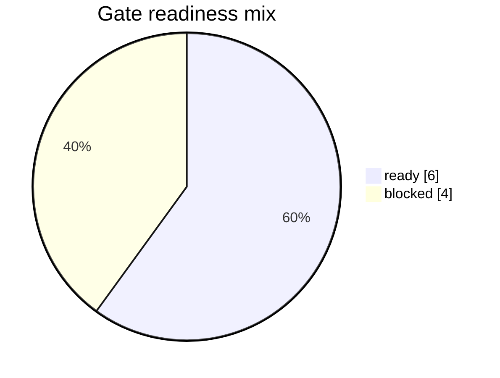
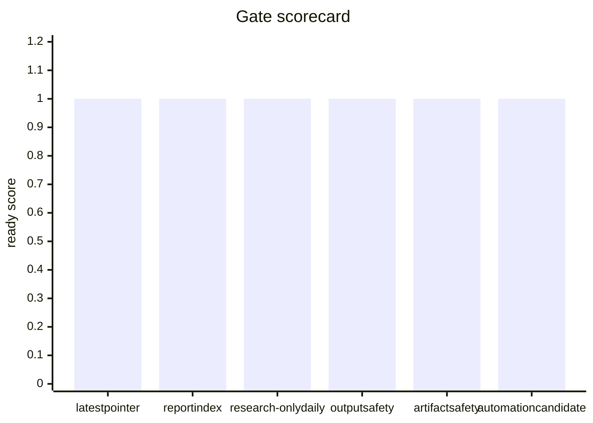
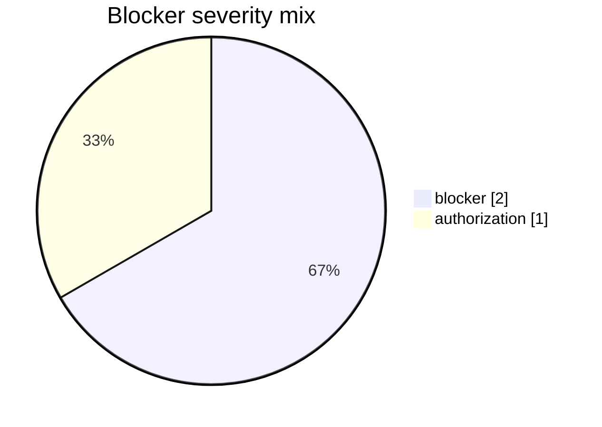
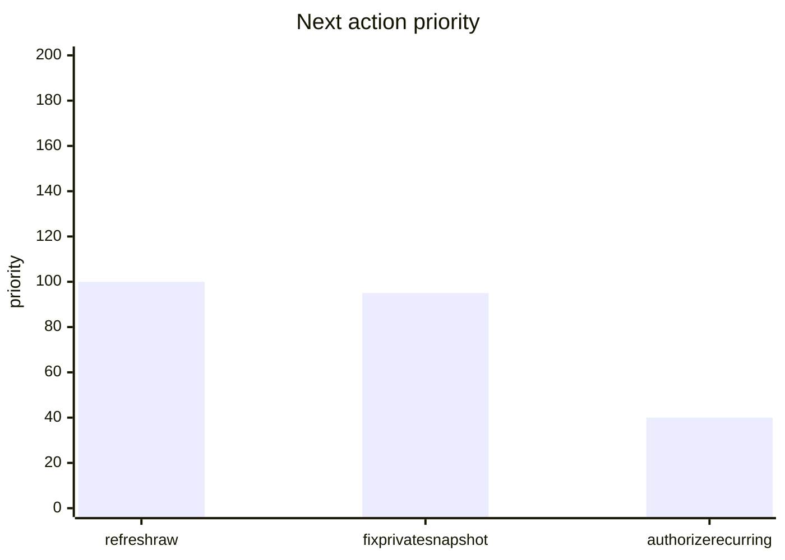

# TAB FIFA Automation Readiness Report

本报告用于判断本地系统是否可以发布正式盘口研究日报或进入 recurring automation。它只做报告生成审计，不执行下注。

## Executive Status

- status: `research_only_daily_ready_formal_blocked`
- formal_report_publish_ready: `False`
- recurring_automation_ready: `False`
- research_only_daily_report_ready: `True`
- research_only_recurring_candidate_ready: `True`
- latest_success_run_id: `20260604T135753Z-212e8e9a`
- report_date: `04062026`
- partial_daily_status: `ready_research_only` / scope `current_discovery+partial_raw_success` / PDF `partial_daily_research_latest.pdf` / stake `AUD 0`
- private_position_status: `raw_ready_import_needed`
- command_mode: ``

## Visual Summary

### Gate readiness mix

### Gate scorecard

### Blocker severity mix

### Next action priority

## Gate Matrix

| Gate | Status | Evidence |
|---|---|---|
| latest success pointer | ready | `20260604T135753Z-212e8e9a` / `5/5` |
| report index consistency | ready | committed `20260604T135753Z-212e8e9a` / success `20260604T135753Z-212e8e9a` |
| TAB raw freshness | blocked | ready `0/5` / status `blocked` |
| research-only daily PDF | ready | `ready_research_only` / `current_discovery+partial_raw_success` / `4/5` / stake `AUD 0` |
| current technical preflight | blocked | run `20260613T043303Z-593b5282` / technical `False` |
| private position bootstrap | blocked | `04062026` / `raw_ready_import_needed` |
| output safety | ready | blockers `0` |
| artifact safety | ready | issues `0` |
| automation candidate | ready | `4h` / `review_required_not_installed` |
| recurring authorization | blocked | authorization remains user-controlled |

## Blockers

- `raw_refresh_blocked` / `blocker`: 2026 World Cup Matches raw snapshot is stale.; 2026 World Cup Futures raw snapshot is stale.; 2026 World Cup Group Betting raw snapshot is stale.; 2026 World Cup Australia Markets raw snapshot is stale.; 2026 World Cup Team Futures Multi raw snapshot is stale.
- `current_preflight_blocked` / `blocker`: raw snapshot refresh failed; refusing to generate report: staged raw validation gate failed; refusing to publish raw snapshots: board refresh failures: australia_markets: australia_markets refresh failed after 1 attempt(s): {
  "error": "2026 World Cup Australia Markets route mismatch: landed on 2026 World Cup Matches; TAB live soccer nav may not list this board"
}; 2026 World Cup Australia Markets staged raw snapshot is missing.; Raw refresh batch manifest is missing: raw_refresh_batch_latest.json.
- `recurring_authorization_missing` / `authorization`: user has not authorized recurring automation

## Next Actions

- TAB 当前导航未列出该板块或深链路由到其他板块；先重新发现 Soccer live board list，若仍缺失则将该板块标记为 temporarily unavailable review queue，不用旧盘口生成建议。
- 已读取私有持仓 raw text；下一步运行 `python3 import_my_bets_snapshot.py --source <private raw text for 04062026> --report-date 04062026`。
- 在用户明确授权前仅允许手动/一次性报告生成，不创建 recurring automation。

## Public Artifacts Checked

- `04062026_20260604T135753Z-212e8e9a.pdf`
- `automation_safety_gate.json`
- `daily_report_manifest_20260604T135753Z-212e8e9a.json`
- `portfolio_automation_gate_v0_12.json`
- `portfolio_daily_compare_v0_11.json`
- `portfolio_report_baseline_v0_11.json`
- `previous_report_baseline_v0_11.json`
- `raw_refresh_batch_latest.json`
- `raw_refresh_diagnostics_20260604T135753Z-212e8e9a.json`
- `raw_refresh_health_latest.json`
- `raw_refresh_manifest_latest.json`
- `report_index_20260604T135753Z-212e8e9a.json`
- `report_index_latest.json`
- `tab_fifa_bankroll_plan_04062026_20260604T135753Z-212e8e9a.json`
- `tab_fifa_dashboard_20260604T135753Z-212e8e9a.html`
- `tab_fifa_dashboard_data_20260604T135753Z-212e8e9a.json`
- `tab_fifa_model_comparison_v0_1.json`
- `tab_fifa_model_comparison_v0_1.md`
- `tab_fifa_portfolio_readiness_v0_12.md`
- `tab_fifa_reports.sqlite3`