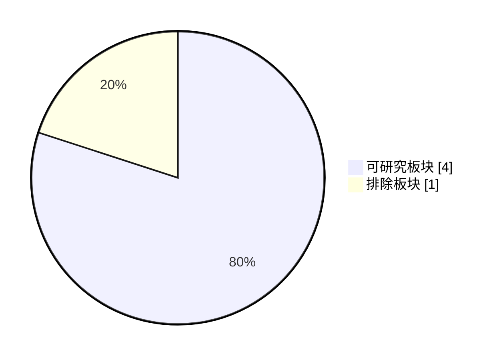

# TAB FIFA 可用板块策略 Dashboard

本报告把 TAB live discovery 结果转换为报告范围和下注研究策略；只读，不自动下注。

## Executive Summary

- status: `research_only`
- 当前动作: 只看可用板块研究诊断；新增执行金额 AUD 0
- 可研究板块: `4/5`
- scope source: `current_discovery+partial_raw_success`
- last-success fallback: `fresh_last_success` / used `True` / age `0.06`h
- partial raw freshness: `4/5` / `fresh_research_only` / age `0.41`h
- 排除板块: `1`
- executable_report_allowed: `False`
- research_diagnostic_allowed: `True`
- 当前新增执行金额: `AUD 0`
- 下一步: 当前排除缺失板块：Australia Markets；先继续 discovery/raw 恢复，不发布新增下注。

## old_new_compare / 新旧范围对比

- compare_status: `compared_with_previous_snapshot`
- previous_generated_at: `2026-06-13T15:02:55.668030+10:00`
- listed_count_delta: `0`
- missing_count_delta: `0`
- summary: 与上一版策略范围一致。

## Board Scope Matrix

| 板块 | Live nav | 报告范围 | 可执行用途 | 金额策略 | 原因 | 下一步 |
|---|---|---|---|---|---|---|
| 2026 World Cup Matches | listed | research_diagnostic_allowed | 不可执行；正式 raw/private/preflight 门禁未全部通过。 | research-only raw 仅支持研究诊断；新增执行金额 AUD 0 | Matches 已在 partial raw 中成功抓取并通过验证；当前只允许 No-execution 研究使用。 | 使用 research-only raw 进入研究诊断；继续修复正式 raw 门禁 |
| 2026 World Cup Futures | listed | research_diagnostic_allowed | 不可执行；正式 raw/private/preflight 门禁未全部通过。 | research-only raw 仅支持研究诊断；新增执行金额 AUD 0 | Futures 已在 partial raw 中成功抓取并通过验证；当前只允许 No-execution 研究使用。 | 使用 research-only raw 进入研究诊断；继续修复正式 raw 门禁 |
| 2026 World Cup Group Betting | listed | research_diagnostic_allowed | 不可执行；正式 raw/private/preflight 门禁未全部通过。 | research-only raw 仅支持研究诊断；新增执行金额 AUD 0 | Group Betting 已在 partial raw 中成功抓取并通过验证；当前只允许 No-execution 研究使用。 | 使用 research-only raw 进入研究诊断；继续修复正式 raw 门禁 |
| 2026 World Cup Australia Markets | missing_from_live_nav | unavailable_excluded | 不可执行，不纳入金额分配。 | 新增执行金额 AUD 0，直到 live/deep link/raw 重新恢复 | Australia Markets 在 partial raw 本轮失败；不得使用旧盘口补齐。 | 保留 unavailable review queue；等待 TAB 重新列出或 deep link 恢复 |
| 2026 World Cup Team Futures Multi | missing_from_live_nav | research_diagnostic_allowed | 不可执行；正式 raw/private/preflight 门禁未全部通过。 | research-only raw 仅支持研究诊断；新增执行金额 AUD 0 | Team Futures Multi 已在 partial raw 中成功抓取并通过验证；当前只允许 No-execution 研究使用。 | 使用 research-only raw 进入研究诊断；继续修复正式 raw 门禁 |

## Last-success Fallback

| 状态 | 使用 | 生成时间 | Age h | SLA h | 可研究板块 | 说明 |
|---|---:|---|---:|---:|---:|---|
| fresh_last_success | 是 | 2026-06-13T15:02:55.668030+10:00 | 0.06 | 4.0 | 4 | 当前 discovery 被阻断时，使用仍在4小时SLA内的上一份成功范围做研究-only 延续。 |

## Operation Policy

- 不自动下注；不点击赔率；不加入 下注单。
- 只允许 live listed 或 4小时SLA内 research-only raw 已通过 staged gate 的板块进入研究诊断，不允许发布当前可执行新增下注日报。
- 当前 discovery 被 Access Denied 阻断时，4小时内 last-success 只可用于研究范围延续；不能解锁新增下注执行金额。
- partial raw fresh 只证明部分板块有 4 小时内研究证据；它不能替代 5/5 required raw、私有持仓和日报发布门禁。
- live/raw/private/preflight 任一门禁未通过时，新增执行金额保持 AUD 0；旧报告买入项只能作为研究候选复核。
- 后续胜负会影响余额与预算；但当前 live scope 不完整时，不能为了提高资金利用率而使用缺失板块的旧盘口。

