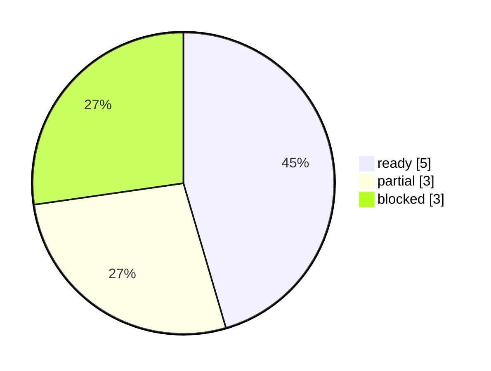

# TAB FIFA 目标验收追踪 Dashboard

本报告把用户目标逐项映射到当前代码、报告、Dashboard、SQLite、开源模型和自动化门禁证据。它不自动下注，也不把 blocked run 当作可执行日报。

## Executive Summary

- goal_ready: `False`
- status: `in_progress`
- overall_score: `65.14%`
- ready / partial / blocked: `5 / 3 / 3`
- primary_gap: `公开盘口实时抓取门禁`
- recommended_next_action: 从本地入口点击“刷新公开盘口”；若 TAB live 仍缺失板块，继续 unavailable 策略，不用旧盘口生成下注建议。

## Visual Summary

## 新旧追踪变化

- compare_status: `compared_with_previous_snapshot`
- previous_generated_at: `2026-06-13T14:37:49.980076+10:00`
- score_delta: `-0.0545`
- newly_ready: `none`
- newly_blocked: `TAB 当前可见板块已进入策略范围控制`

## 目标验收矩阵

| 目标项 | 状态 | 得分 | 证据 | 缺口 | 下一步 | 用户价值 |
|---|---|---:|---|---|---|---|
| ChatGPT/需求文件与当前 personalization 已纳入 | partial | 65.00% | 已读取/维护 5 个本地需求/交接文件；ChatGPT Excel 模板存在=False；原始 prompt 文件存在=False | Downloads 中未找到 fifa_codex_build_prompt.txt；当前以 ChatGPT Excel 模板、PRD、README、RUNBOOK、HANDOFF 和用户最新指令作为需求证据。 | 若后续拿到原始 build prompt，加入 source_trace 后重新生成本报告；当前继续以已提供 Excel 模板和本地权威文件为准。 | 避免凭记忆做系统，所有需求来源都可追踪。 |
| GitHub 开源模型已访问并转化为本地模型/界面参考 | ready | 100.00% | source_audit=True；implemented=3/6；design=3；UI蓝图=4/6；GitHub元数据=ready 6/6 | 无 | 保持自动审计，并在每次刷新后重新验证。 | 下注概率不只看隐含概率，且开源模型的功能、布局、界面和 UI 已转成本地 Dashboard 蓝图。 |
| 所有公开报告族具备图表、表格和 Dashboard | ready | 100.00% | reports=21；charts=21；tables=21；dashboard=21 | 无 | 保持自动审计，并在每次刷新后重新验证。 | 报告不是纯文本，打开就能看图表和状态。 |
| 首页优先显示推荐下注板块和主动测试按钮 | ready | 100.00% | recommendation_first=True；active_test_in_recommendation=True；required_columns=21/21 | 无 | 保持自动审计，并在每次刷新后重新验证。 | 一眼知道看哪个盘、下注什么、金额多少、为什么，以及缺口是否需要补跑。 |
| 报告保存为 PDF 并列入本地数据库 | ready | 90.00% | latest_pdf_date=04062026；runs=61；recommendations=2318；artifacts=696 | 无 | 保持自动审计，并在每次刷新后重新验证。 | PDF 可归档，数据库可做日报/周报、回测和趋势分析。 |
| 新报告新增和旧报告对比 | ready | 100.00% | report_diffs=61；current_compare_changed=0；retained=38 | 无 | 保持自动审计，并在每次刷新后重新验证。 | 知道哪些推荐新增、删除、变强或变弱，减少重复下注。 |
| 主动测试会按每天 4 次分析 + 1 份日报检查并补缺 | partial | 55.00% | day_count=9；missing_analysis=5；missing_report=8；backfill_status=blocked_by_raw_refresh | 公开盘口 raw 未就绪时，补跑被正确阻断，缺口仍存在。 | 先恢复 raw；raw_ready=true 后再运行 safe_no_latest_publish 补跑。 | 系统能主动发现漏跑和漏报，不靠人工记忆检查。 |
| 公开盘口实时抓取门禁 | blocked | 0.00% | ready=False；required=0/5；blockers=refresh_command_failed, route_mismatch, stale_raw；discovery_ready=True；discovery_retry=0 | raw refresh blocked/stale，且 Australia Markets 存在 route mismatch。 | 从本地入口点击“刷新公开盘口”；若 TAB live 仍缺失板块，继续 unavailable 策略，不用旧盘口生成下注建议。 | 只有实时盘口通过，才允许把研究候选升级为当前可执行建议。 |
| TAB 当前可见板块已进入策略范围控制 | blocked | 0.00% | research_allowed=0/5；unavailable=5；retry=0；executable=False | 当前只允许研究诊断，不允许新增执行金额。 | 继续排除 Australia Markets 和 Team Futures Multi，直到 TAB live 重新列出并通过 raw/preflight。 | 不会为了覆盖完整而拿旧板块数据误导下注。 |
| 已下注持仓、余额和收益率可滚动更新 | partial | 45.00% | private_status=raw_ready_import_needed；snapshot_ready=False；monitor=blocked；storage=stored | 当前私有持仓快照不适用于最新报告日期；公开报告保持 account-update-pending，无法更新真实持仓金额和累计收益率。 | 在 .app 中启动只读持仓读取；用户完成 TAB 授权后导入快照，再重跑日报门禁。 | 胜负结果能改变余额和后续下注金额，策略更贴近真实资金曲线。 |
| 达到 automation 水平但不自动下注 | blocked | 61.54% | maturity_ready=8/13；recurring=False；auto_wagering=False | raw、每日节奏、每日 PDF、私有持仓和 recurring 授权仍阻塞。 | 先修 P0 数据门禁；只有用户明确允许后才安装每日报告 automation；allow_auto_betting 保持 false。 | 系统最终能每日自动生成研究报告，但不会越权下注。 |

## Source Trace

- requirements_trace_ready: `False`
- chatgpt_template_exists: `False`
- original_prompt_exists: `False`
- available_source_count: `5`
- `HANDOFF.md`：当前跨轮交接和最新真实状态
- `fifa_prd_and_technical_plan.md`：早期 PRD/技术方案和非目标边界
- `HANDOFF.md`：当前 pipeline 级实现状态、验证命令和剩余风险
- `README.md`：当前本地 app、runner、报告和按钮行为说明
- `RUNBOOK.md`：自动化授权边界和运行手册

> 本追踪报告只证明目标满足度和缺口；不会把 raw/private/preflight 失败的 attempted run 宣布为可下注日报，也不会自动下注。