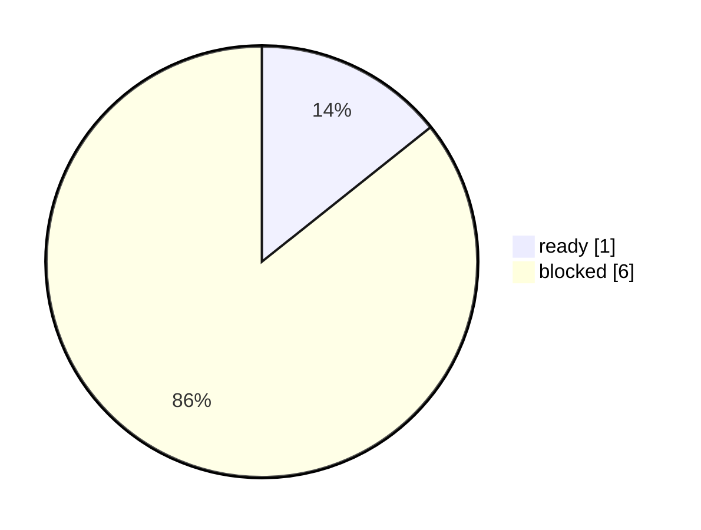

# TAB FIFA 持仓监控 Dashboard

本报告监控持仓快照、余额/收益率更新条件和日报门禁。公开版本只展示聚合状态，不展示账户余额、逐笔下注或私有路径。

## Executive Summary

- status: `blocked`
- decision: 持仓监控未就绪；余额、持仓金额和累计收益率保持 account-update-pending。
- report_date: `13062026`
- snapshot_ready: `False`
- public_visible_balance: `account-update-pending`
- public_visible_open_exposure: `account-update-pending`
- public_visible_realized_roi: `account-update-pending`
- preflight_status: `profile_login_required`
- login_window_required: `True`
- credential_policy: 不读取、不保存、不填写账号密码或OTP；只复用用户授权的本机 profile。
- automation_boundary: 只读抓取、导入私有快照、重跑报告门禁；禁止赔率点击、下注单修改和自动下注。
- next_action: 并行处理两个门禁：建立或刷新 TAB 专用已登录 profile：`TAB_FIFA_HEADLESS=0 node scripts/capture_tab_my_bets_readonly.mjs --report-date 13062026 --wait-for-login-ms 600000`。 同时恢复公开盘口 raw；两者都 ready 后重跑日报门禁。

## Visual Summary

## 新旧变化

- compare_status: `compared_with_previous_snapshot`
- previous_generated_at: `2026-06-13T14:36:18.295641+10:00`
- summary: 持仓监控状态未改善。

## 监控矩阵

| 项目 | 状态 | Ready | 证据 | 下一步 |
|---|---|---|---|---|
| 持仓快照 | missing | 否 | 当日私有快照必须存在并通过状态校验。 | 导入或刷新当日只读快照。 |
| 只读原文读取 | missing | 否 | 只读文本用于生成私有快照，不进入公开报告。 | 如果缺失，从 .app 启动只读持仓读取。 |
| TAB 专用 profile | present | 是 | 专用 profile 用于保留授权，不保存到公开产物。 | 保持自动审计。 |
| 只读授权 Preflight | profile_login_required | 否 | TAB 授权状态不可用（login_required），需要用户在本机窗口完成授权。 | 点击“启动只读持仓读取”，在打开的 TAB 窗口完成授权，系统只读取持仓页文本。 |
| 公开盘口 raw | blocked | 否 | 公开盘口必须先通过，持仓结果才进入日报门禁。 | 点击刷新公开盘口。 |
| 主动测试缺口 | 8 | 否 | 持仓变化会影响后续预算，缺口需先补齐。 | raw 恢复后执行 safe_no_latest_publish 补跑。 |
| 余额/收益率显示 | account-update-pending | 否 | 公开报告不展示账户余额；私有快照 ready 后可供日报门禁使用。 | 快照 ready 后重跑日报。 |

> 持仓监控不会自动下注；当私有快照缺失、过期或校验失败时，余额、持仓金额和累计收益率保持 account-update-pending。