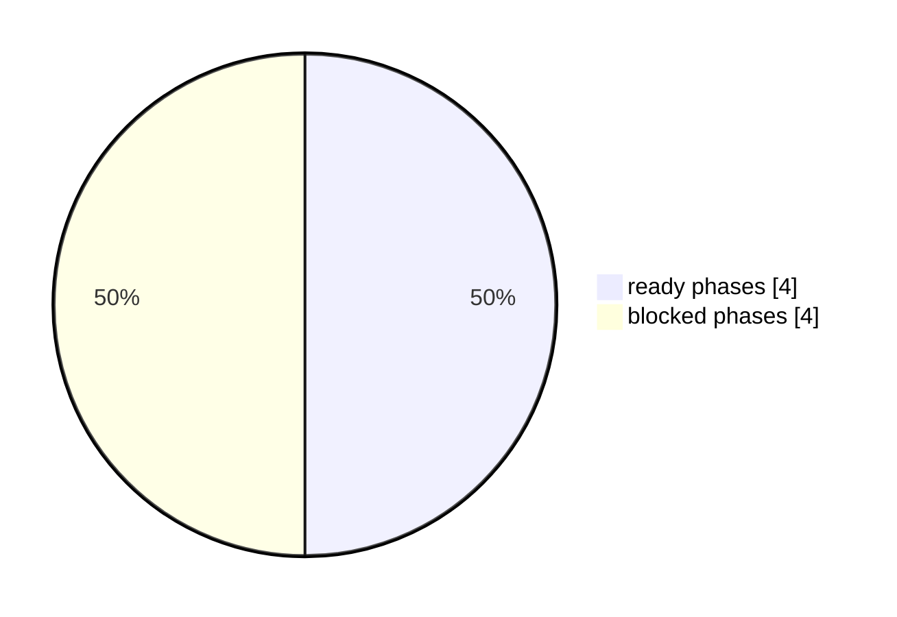

# TAB FIFA Raw Refresh 恢复 Dashboard

本报告聚焦公开盘口 raw 抓取恢复和安全补跑解锁。它只读公开盘口，不自动下注。

## Executive Summary

- status: `blocked`
- diagnostics_status: `failed` / interrupted `False`
- ready_to_backfill: `False`
- raw targets: `0/5`
- attempts: `6`
- board failures: `1` / continued_after_failure `True`
- staged batch manifest skipped: `True`
- access denied attempts: `0`
- route mismatch attempts: `1`
- live discovery: `blocked` / ready `True` / quality `ready` / listed `3` / missing `2`
- effective board scope: `current_discovery+partial_raw_success` / research `4` / unavailable `1` / fallback `False` / fresh `True`
- partial refresh: `4/5` / `fresh_research_only` / age `0.41`h / SLA `4.0`h
- board recovery matrix: `5` / research_only_ready `4` / auto_retry `0` / match_repair `0` / unavailable `1` / partial_coverage `0` / validation_fix `0` / staged_validation `0` / manual_review `0`
- Matches repair validation: `passed` / passed `True` / matches `9` / markets `54` / errors `0`
- backfill queue: `8`
- primary_blocker: `TAB live 当前未列出 Australia Markets / deep link 路由到 Matches`
- recommended_next_action: 重新发现 TAB Soccer live board list；若 Australia Markets 仍缺失，保持该板块 unavailable，不用旧盘口生成下注建议。

## Visual Summary

## 恢复阶段

| 阶段 | 状态 | 证据 | 下一步 |
|---|---|---|---|
| 诊断 Access Denied / 板块错配 / stale raw | ready | attempts=6；board_failures=1；continued_after_failure=True；access_denied=False；route_mismatch=True | 保留最近 raw_refresh_diagnostics_latest.json，用于判断是否是 TAB 访问状态、Chrome 授权、板块下架/改名或批次问题。 |
| 发现 TAB Soccer live board list | ready | listed=3/5；missing=2；quality=ready | route mismatch 时先读取 live_board_discovery_latest.json，缺失板块进入 unavailable review queue。 |
| 确认当前研究范围来源 | ready | scope=current_discovery+partial_raw_success；research=4/5；excluded=1；fallback=False；fallback_fresh=True | 当前 discovery 失败时，只允许使用 4 小时内 last-success 范围生成 research-only 诊断；不能解锁新增下注。 |
| 记录 partial raw freshness 研究证据 | ready | status=partial_ready；freshness=fresh_research_only；success=4/5；age=0.41h | 只把成功板块用于研究诊断；全量 raw/private/preflight 未通过时，新增执行金额仍为 AUD 0。 |
| 重新执行 headed 只读公开盘口刷新 | blocked | raw_ready=False；targets=0/5 | 点击本地入口“刷新公开盘口”；Matches 分块遇到 Access Denied 时会自动触发 headed fallback；成功前不触发补跑。 |
| 验证 5 个 required board 同批次 | blocked | batch_ready=True；manifest_ready=True | 确认 5 个 raw 都来自同一 refresh_id，并通过 batch manifest sha256 检查。 |
| 更新当日私有持仓快照 | blocked | private_position_ready=False | raw 恢复后启动只读持仓读取；用真实余额和已下注结果更新预算。 |
| 执行安全补跑队列 | blocked | queue=8；last_backfill=blocked_by_raw_refresh | 仅生成 run-scoped PDF，不发布 latest_commit；补齐每日 4 次分析和日报缺口。 |

## 目标板块状态

| 板块 | 状态 | fresh | valid | driver | blocker |
|---|---|---|---|---|---|
| 2026 World Cup Matches | blocked | 否 | 是 | 是 | stale_raw |
| 2026 World Cup Futures | blocked | 否 | 是 | 是 | stale_raw |
| 2026 World Cup Group Betting | blocked | 否 | 是 | 是 | stale_raw |
| 2026 World Cup Australia Markets | blocked | 否 | 是 | 是 | stale_raw |
| 2026 World Cup Team Futures Multi | blocked | 否 | 是 | 是 | stale_raw |

## 板块级恢复矩阵

| 优先级 | 板块 | live状态 | raw状态 | partial | attempts | staged错误 | 修复验证 | action | 是否可自动重试 | 成功门禁 | 下一步 |
|---:|---|---|---|---|---:|---:|---|---|---|---|---|
| 1 | 2026 World Cup Matches | listed | blocked | partial_success | 2 | 0 | passed | research_only_ready | 否 | research-only raw 保持 4小时内 fresh/valid；正式执行仍等待 5/5 raw、私有持仓和发布门禁。 | 纳入 research-only 诊断；继续等待完整 raw gate，不生成新增执行下注。 |
| 2 | 2026 World Cup Futures | listed | blocked | partial_success | 1 | 0 | missing | research_only_ready | 否 | research-only raw 保持 4小时内 fresh/valid；正式执行仍等待 5/5 raw、私有持仓和发布门禁。 | 纳入 research-only 诊断；继续等待完整 raw gate，不生成新增执行下注。 |
| 3 | 2026 World Cup Group Betting | listed | blocked | partial_success | 1 | 0 | missing | research_only_ready | 否 | research-only raw 保持 4小时内 fresh/valid；正式执行仍等待 5/5 raw、私有持仓和发布门禁。 | 纳入 research-only 诊断；继续等待完整 raw gate，不生成新增执行下注。 |
| 4 | 2026 World Cup Australia Markets | missing_from_live_nav | blocked | partial_failed | 1 | 0 | missing | mark_unavailable_review | 否 | TAB live nav 重新列出该板块，且 deep link resolves 到预期 competition。 | 保持 unavailable review queue；不使用旧盘口，不生成该板块当前执行建议。 |
| 5 | 2026 World Cup Team Futures Multi | missing_from_live_nav | blocked | partial_success | 1 | 0 | missing | research_only_ready | 否 | research-only raw 保持 4小时内 fresh/valid；正式执行仍等待 5/5 raw、私有持仓和发布门禁。 | 纳入 research-only 诊断；继续等待完整 raw gate，不生成新增执行下注。 |

## Matches Repair Live Validation

该证据只证明盘口展开修复在只读测试中可用，不解锁全量 raw 或新增下注金额。

| 项目 | 值 |
|---|---|
| status | passed |
| passed | 是 |
| scope | pre-raw live discovery targets, matches-only staging validation |
| trigger | pre_raw_live_board_discovery refreshed targets before raw refresh; previous stale target USA v Paraguay excluded |
| matches / markets / errors | 9 / 54 /  |
| validated matches | Qatar v Switzerland、Brazil v Morocco、Haiti v Scotland、Australia v Turkiye、Germany v Curacao、Netherlands v Japan、Cote d Ivoire v Ecuador、Sweden v Tunisia |
| guard | temporary staging only; market header expansion only; no odds click; no wager state mutation |

## Partial Raw Freshness Evidence

该部分只证明部分板块可用于研究诊断，不证明全量可执行下注日报。

| 项目 | 值 |
|---|---|
| status | partial_ready |
| freshness_status | fresh_research_only |
| fresh_within_sla | 是 |
| age / SLA | 0.41h / 4.0h |
| successful boards | 2026 World Cup Matches、2026 World Cup Futures、2026 World Cup Group Betting、2026 World Cup Team Futures Multi |
| failed boards | 2026 World Cup Australia Markets |
| execution_allowed | 否 |
| current_research_only_allowed | 是 |
| historical_research_evidence_available | 是 |
| note | 来自 raw_refresh_research_only_latest.json；只用于当日研究诊断，不允许下注执行。 |

## 最近尝试

| board | attempt | exit | access_denied | chunk | error |
|---|---:|---|---|---|---|
| matches | 1 |  | 否 | 0-5 |  |
| matches | 2 |  | 否 | 5-4 |  |
| futures | 1 |  | 否 | - |  |
| group_betting | 1 |  | 否 | - |  |
| australia_markets | 1 | 1 | 否 | - | {   "error": "2026 World Cup Australia Markets route mismatch: landed on 2026 World Cup Matches; TAB live soccer nav may not list this board" } |
| team_futures_multi | 1 |  | 否 | - |  |

## 单板失败隔离

| 顺序 | board | output | error |
|---:|---|---|---|
| 1 | australia_markets | tab_fifa_world_cup_australia_markets_expanded_raw_v0_17.json | australia_markets refresh failed after 1 attempt(s): {   "error": "2026 World Cup Australia Markets route mismatch: landed on 2026 World Cup Matches; TAB live soccer nav may not list this board" } |

## 下一次刷新计划

| 顺序 | 范围 | 触发条件 | 操作 | 模式 | 成功门禁 |
|---:|---|---|---|---|---|
| 1 | 2026 World Cup Australia Markets | live board route mismatch / board not listed | 重新发现 TAB Soccer live board list；若仍不在导航中，保持该板块 unavailable，不用旧盘口生成下注建议；discovery listed=3/5, missing=2 | live_board_discovery_review | board URL resolves to Australia Markets and 14 expected markets priced |
| 2 | Backfill queue | raw_refresh_ready=true | 解锁 safe_no_latest_publish 补跑，不推进 latest_commit | safe_no_latest_publish | 补跑 run-scoped PDF 生成并写入 active_timeline_audits |

## 补跑队列预览

| 顺序 | 日期 | 分数 | 原因 | 模式 |
|---:|---|---:|---|---|
| 1 | 07/06/2026 | 160 | 有效分析 0/4；Downloads 正式日报缺失 | safe_no_latest_publish |
| 2 | 08/06/2026 | 160 | 有效分析 0/4；Downloads 正式日报缺失 | safe_no_latest_publish |
| 3 | 09/06/2026 | 160 | 有效分析 0/4；Downloads 正式日报缺失 | safe_no_latest_publish |
| 4 | 10/06/2026 | 160 | 有效分析 0/4；Downloads 正式日报缺失 | safe_no_latest_publish |
| 5 | 11/06/2026 | 160 | 有效分析 0/4；Downloads 正式日报缺失 | safe_no_latest_publish |
| 6 | 06/06/2026 | 75 | Downloads 正式日报缺失 | safe_no_latest_publish |
| 7 | 12/06/2026 | 75 | Downloads 正式日报缺失 | safe_no_latest_publish |

## old_new_compare / 新旧恢复变化

- compare_status: `compared_with_previous_artifact`
- previous_generated_at: `2026-06-13T15:02:58.945285+10:00`
- changed_count: `0/20`
- summary: 0/20 个关键指标发生变化。

| 指标 | 当前 | 上一版 | 变化 |
|---|---:|---:|---:|
| status | blocked | blocked | 0 |
| ready_to_backfill | false | false | 0 |
| raw_ready | false | false | 0 |
| ready_required_target_count | 0 | 0 | 0 |
| required_target_count | 5 | 5 | 0 |
| board_failure_count | 1 | 1 | 0 |
| continued_after_board_failure | true | true | 0 |
| access_denied_attempt_count | 0 | 0 | 0 |
| route_mismatch_attempt_count | 1 | 1 | 0 |
| backfill_queue_count | 8 | 8 | 0 |
| live_discovery_missing_expected_count | 2 | 2 | 0 |
| effective_board_scope_source | current_discovery+partial_raw_success | current_discovery+partial_raw_success | 0 |
| effective_board_scope_research_allowed_count | 4 | 4 | 0 |
| effective_board_scope_unavailable_count | 1 | 1 | 0 |
| partial_refresh_successful_board_count | 4 | 4 | 0 |
| partial_refresh_freshness_status | fresh_research_only | fresh_research_only | 0 |
| board_recovery_research_only_ready_count | 4 | 4 | 0 |
| board_recovery_match_repair_count | 0 | 0 | 0 |
| matches_repair_validation_status | passed | passed | 0 |
| board_recovery_partial_coverage_count | 0 | 0 | 0 |

> 公开盘口 raw 未就绪时，补跑必须保持 blocked_by_raw_refresh；不能用旧盘口生成可执行下注日报。