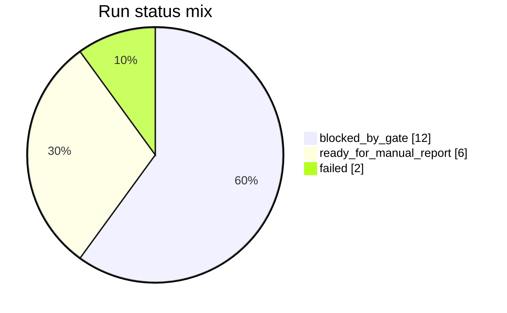
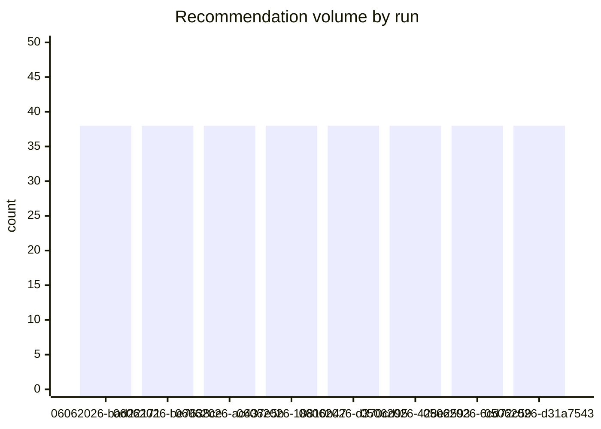
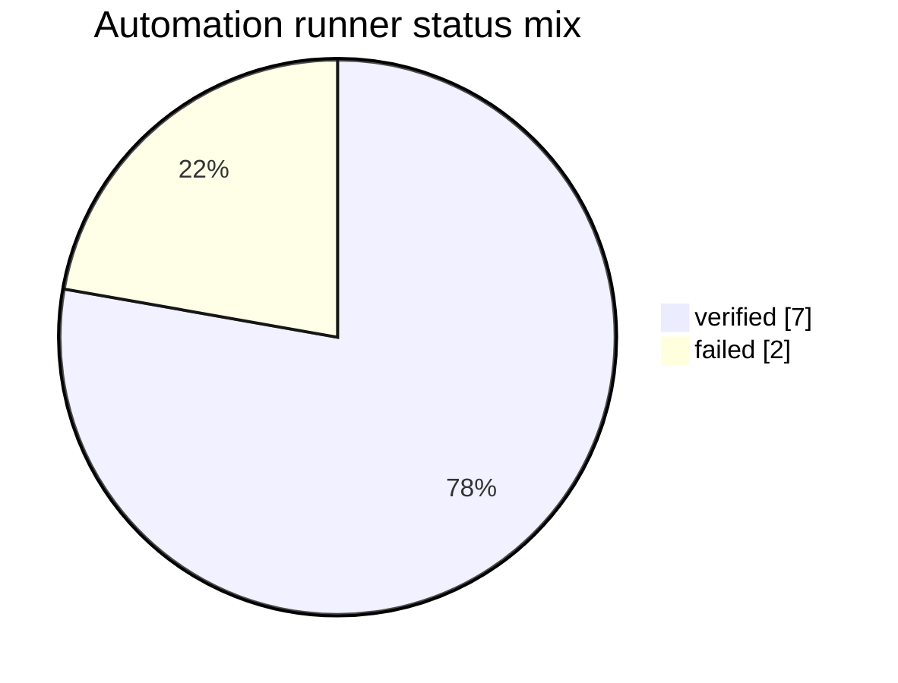

# TAB FIFA Report History Index

本报告把本地 SQLite 历史记录转换为可审阅的报告索引，用于追踪每次日报的新旧变化、图表覆盖、推荐数量和发布状态。它不生成新的下注建议。

## Executive Status

- committed_latest_run_id: `20260604T135753Z-212e8e9a`
- latest_success_run_id: `20260604T135753Z-212e8e9a`
- latest_report_date: `04062026`
- run_count: `20`
- automation_run_count: `9`
- latest_status: `ready_for_manual_report`

## Visual Summary

### Run status mix

### Technical readiness by recent run

_暂无可绘制数据。_

### Recommended new exposure by run

_暂无可绘制数据。_

### Recommendation volume by run

### New-vs-old changed items by run

_暂无可绘制数据。_

### Automation runner status mix

### Automation publish readiness by runner

_暂无可绘制数据。_

## Recent Runs

| Run | Date | Status | Tech | Raw | Safety | Portfolio | Recs | Charts | Exposure AUD | Added | Changed | Removed |
|---|---|---|---:|---:|---:|---:|---:|---:|---:|---:|---:|---:|
| 20260605T232012Z-bad22171 | 06062026 | blocked_by_gate | 0 | 0 | 0 | 0 | 38 | 10 | 0.00 | 0 | 0 | 0 |
| 20260605T225259Z-be7638ce | 06062026 | blocked_by_gate | 0 | 0 | 0 | 0 | 38 | 10 | 0.00 | 0 | 0 | 0 |
| 20260605T220116Z-ac437e5b | 06062026 | blocked_by_gate | 0 | 0 | 0 | 0 | 38 | 10 | 0.00 | 0 | 0 | 0 |
| 20260605T213802Z-18810b47 | 06062026 | blocked_by_gate | 0 | 0 | 0 | 0 | 38 | 10 | 0.00 | 0 | 0 | 0 |
| 20260605T195704Z-d370cd95 | 06062026 | blocked_by_gate | 0 | 0 | 0 | 0 | 38 | 10 | 0.00 | 0 | 0 | 0 |
| 20260605T111049Z-428e2593 | 05062026 | blocked_by_gate | 0 | 0 | 0 | 0 | 38 | 10 | 0.00 | 0 | 0 | 0 |
| 20260605T084257Z-6cd72c59 | 05062026 | blocked_by_gate | 0 | 0 | 0 | 0 | 38 | 10 | 0.00 | 0 | 0 | 0 |
| 20260605T082615Z-d31a7543 | 05062026 | blocked_by_gate | 0 | 0 | 0 | 0 | 38 | 10 | 0.00 | 0 | 0 | 0 |
| 20260605T064819Z-e3602800 | 05062026 | blocked_by_gate | 0 | 0 | 0 | 0 | 38 | 10 | 0.00 | 0 | 0 | 0 |
| 20260605T055626Z-ba247362 | 05062026 | blocked_by_gate | 0 | 0 | 0 | 0 | 38 | 10 | 0.00 | 0 | 0 | 0 |
| 20260605T053308Z-e1c56980 | 05062026 | blocked_by_gate | 0 | 0 | 0 | 0 | 38 | 10 | 0.00 | 0 | 0 | 0 |
| 20260605T045508Z-1e503a13 | 05062026 | failed | 0 | 0 | 0 | 0 | 38 | 10 | 0.00 | 0 | 0 | 0 |
| 20260604T213057Z-db1e3650 | 04062026 | failed | 0 | 0 | 0 | 0 | 38 | 10 | 0.00 | 0 | 0 | 0 |
| 20260604T141232Z-d2eff3e0 | 05062026 | blocked_by_gate | 0 | 0 | 0 | 0 | 38 | 10 | 0.00 | 0 | 0 | 0 |
| 20260604T141023Z-817e2977 | 05062026 | ready_for_manual_report | 0 | 1 | 1 | 1 | 38 | 10 | 100.00 | 0 | 0 | 0 |
| 20260604T135753Z-212e8e9a | 04062026 | ready_for_manual_report | 1 | 1 | 1 | 1 | 38 | 10 | 100.00 | 0 | 0 | 0 |
| 20260604T135315Z-871b092c | 04062026 | ready_for_manual_report | 1 | 1 | 1 | 1 | 38 | 10 | 100.00 | 0 | 0 | 0 |
| 20260604T134623Z-8f44df8b | 04062026 | ready_for_manual_report | 1 | 1 | 1 | 1 | 38 | 10 | 100.00 | 0 | 0 | 0 |
| 20260604T133257Z-8fc567ae | 04062026 | ready_for_manual_report | 1 | 1 | 1 | 1 | 38 | 10 | 100.00 | 0 | 0 | 0 |
| 20260604T132624Z-2a4e122e | 04062026 | ready_for_manual_report | 1 | 1 | 1 | 1 | 38 | 10 | 100.00 | 0 | 0 | 0 |

## Automation Runner History

| Runner | Mode | Verify | Status | Exit | Raw | Publish | Private Capture | Started |
|---|---|---|---|---:|---:|---:|---:|---|
| tab_fifa_daily_20260606T023417Z-50205 | verify-only | hermetic | verified | 0 | 1 | 0 | 0 | 2026-06-06T02:34:17Z |
| tab_fifa_daily_20260606T022109Z-26855 | verify-only | hermetic | verified | 0 | 1 | 0 | 0 | 2026-06-06T02:21:10Z |
| tab_fifa_daily_20260606T013504Z-41760 | verify-only | hermetic | verified | 0 | 1 | 0 | 0 | 2026-06-06T01:35:04Z |
| tab_fifa_daily_20260606T013314Z-38471 | verify-only | hermetic | verified | 0 | 1 | 0 | 0 | 2026-06-06T01:33:15Z |
| tab_fifa_daily_20260606T012700Z-33044 | verify-only | hermetic | verified | 0 | 1 | 0 | 0 | 2026-06-06T01:27:00Z |
| tab_fifa_daily_20260606T012303Z-28376 | verify-only | hermetic | failed | 1 | 1 | 0 | 0 | 2026-06-06T01:23:03Z |
| tab_fifa_daily_20260606T010345Z-8196 | verify-only |  | verified | 0 | 1 | 0 | 0 | 2026-06-06T01:03:45Z |
| tab_fifa_daily_20260606T005300Z-95768 | verify-only |  | failed | 1 | 1 | 0 | 0 | 2026-06-06T00:53:00Z |
| tab_fifa_daily_20260606T003809Z-77622 | verify-only |  | verified | 0 | 1 | 0 | 0 | 2026-06-06T00:38:09Z |