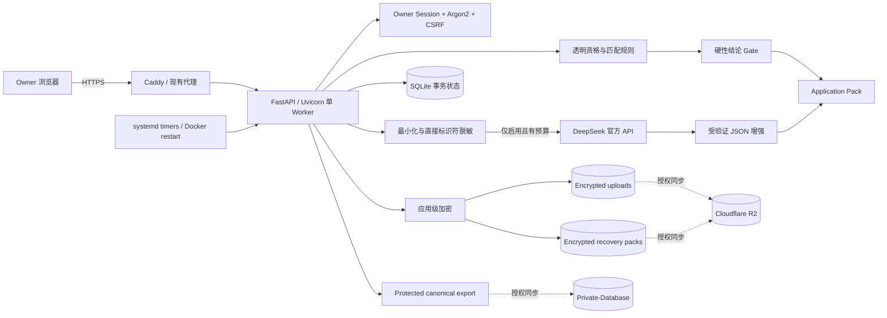

# Architecture, Data, AI, Security & Operations

## 最短纵向架构

## 请求与数据流

1. 目标机既有 Traefik 终止 TLS，只把请求转发到私有 Docker 网络中的 FastAPI。
2. 未登录请求不能进入资料、简历、岗位、设置、导出和备份页面。
3. Session Cookie 签名、`HttpOnly`、`SameSite=Lax`；生产启用 `Secure`。
4. 所有写表单验证 CSRF；登录按来源地址限速。
5. 上传先验证大小/扩展名，再限制 PDF 页数、提取文字量以及 DOCX 压缩包条目、单项和解压总体积；原文件以加密字节写入随机命名 `uploads/*.bin`。
6. 候选人资料、解析文本、经历、申请答案、DeepSeek Key、AI 输出和错误信息在 SQLite 中按字段加密。
7. 岗位 URL 读取只允许 HTTPS 公网地址和 443 端口；初始地址与每次跳转都必须留在已审查 ATS 域名内，并受大小、超时和跳转次数限制；私网、回环、任意域名和受限平台转为“粘贴 JD”。
8. 规则引擎先生成 recommendation、eligibility、fit、reasons、risks、unknowns 和材料选择。
9. 只有 Provider 配置为 enabled、用户已同意、预算未耗尽且熔断未打开时，才经过脱敏网关调用 DeepSeek。
10. DeepSeek 返回必须是可解析、字段受限的 JSON；AI 只增强未被用户确认的文案，不能改写规则结论或已审核内容。
11. Provider 失败时记录非敏感错误码并保留规则结果；此前成功增强可标为 stale，而不是删除。
12. canonical export 不包含 Provider Config 或 Key；AI 增强内容以加密字段进入长期结构化快照。
13. 每次业务变化标记 canonical dirty；维护循环导出并按周期创建恢复包。
14. Private-Database/R2 同步是可观察增强，不是核心事务单点依赖。

## DeepSeek 数据边界

### 允许发送

- 脱敏后的岗位标题、公司、地点和 JD；
- 规则引擎已形成的结论、理由、风险和未知项；
- 移除联系信息头后的简历证据；
- 被选中的经历内容；
- 目标岗位族、工作模式等完成分析所需的非直接标识信息。

### 禁止发送

- API Key 本身；
- 登录密码、Session、CSRF、恢复密钥、第三方账号/Cookie/验证码；
- 姓名、邮箱、电话、LinkedIn/GitHub/portfolio URL；
- 原始文件字节或加密文件；
- 不参与当前岗位判断的私密备注；
- 长期同步凭证。

### Provider 控制

- 官方 Base URL 固定为 `https://api.deepseek.com`；生产拒绝任意自定义中转地址；
- 允许模型固定为 `deepseek-v4-flash` 与 `deepseek-v4-pro`；
- 每日请求/Token 上限、单次输入长度、输出上限、超时、重试和熔断可观察；
- 使用量表只记录模型、模式、Token、耗时、状态和错误码，不保存 Prompt；
- 401/402 会停用或打开较长熔断窗口；429/500/503/网络错误有限重试后降级；
- 规则引擎 readiness 不依赖 Provider。

## 数据权威与保留

| 数据 | 运行位置 | 长期/恢复路径 | 说明 |
|---|---|---|---|
| 用户、Profile、岗位、申请包、事件 | SQLite | 字段加密 canonical JSON + 加密恢复包 | 单用户事务权威 |
| 原始简历 | 加密 `.bin` | 加密恢复包 + 可选 R2 | 不以明文持久化 |
| 结构化经历 | SQLite 字段加密 | 可选 Private-Database | 私人值需恢复密钥解密 |
| DeepSeek Key | Secret file / 环境 / SQLite 加密字段 | 不进入 canonical export | 网页只显示末四位；数据库 Key 可撤销 |
| AI 增强内容 | SQLite 加密字段 | 加密 canonical JSON + recovery pack | 可追溯模型、模式和 Prompt 版本 |
| AI 使用量 | SQLite 非内容元数据 | 可选结构化审计 | 不保存 Prompt/Response 正文 |
| 运行日志 | Docker logs | 不进入业务权威 | 不记录 Key、Prompt 或候选人正文 |
| 同步状态 | `sync_status.json` | UI 只读投影 | `not_configured/failed/synced` 不互相冒充 |

SQLite 是当前单 Owner 的简单正确事务层。公开多租户会改变数据权威、并发、删除权和隔离，属于未来 C3。

## 安全控制

- Argon2 密码；不存在用户也执行等价密码验证；
- 单 Owner、无注册路由；
- CSRF、登录限速、安全响应头、严格 CSP、HSTS；
- 容器非 root、只读根文件系统、无额外 capability、`no-new-privileges`；
- App 不直接映射公网端口；
- Secret 仅进 `.env`/secret file/加密数据库；生成文件权限 `0600`；
- 历史敏感字段自动迁移；对象随机命名；恢复拒绝路径穿越、链接、设备文件和超限展开；
- 岗位抓取有 SSRF 防护；
- 上传默认 10 MiB，并限制 PDF 页数、文本量及 DOCX 解压资源；网页读取默认 2 MiB/12 秒；
- Applied 必须有证据；
- 不连接第三方招聘账号，不处理 CAPTCHA/2FA；
- DeepSeek 不拥有规则裁决权。

## 运行与恢复

- `restart: unless-stopped` 承担容器级恢复；
- 单 Uvicorn Worker 避免 SQLite 与维护任务重复执行；
- `/healthz` 证明进程响应；`/readyz` 核验数据库和持久目录；`/api/status` 暴露非敏感 Provider/同步状态；
- `deploy/deploy.sh` 先创建数据恢复点并保存当前运行镜像为 `previous`；
- 新镜像不就绪时恢复前一镜像；
- `deploy/rollback.sh` 只回滚代码，不倒退业务数据；
- `deploy/restore.sh` 在空白暂存目录恢复、迁移、核验，再切换；失败自动切回；
- systemd timer 独立执行长期同步，不依赖 Agent 会话。

## 容量与成本边界

首版目标为一个 Owner：

- SQLite、单 Worker；
- 上传默认不超过 10 MiB；岗位正文默认不超过 2 MiB；恢复包展开上限 200 MiB；
- 默认保留 14 天本机恢复包；
- DeepSeek 默认每日 60 次、600,000 tokens；Owner 可在网页调整；
- 日常使用 Flash，重要岗位才手动使用 Pro；
- 不引入 Redis、PostgreSQL、向量数据库或 Kubernetes。

## 目标环境只能现场确定的事项

| UNKNOWN | 探针 | Delivery 可适配 | Owner Gate |
|---|---|---|---|
| 默认域名是否空闲 | DNS + 代理/容器清单 | 使用同根未占用子域 | 品牌域必须改变时 |
| 80/443 是否占用 | `ss`、Docker、现有配置 | 接入现有代理 | 无 |
| 目标仓目录 | 搜索现有项目与治理 | 默认 CodexProject 子目录 | 新建仓库时 |
| Private-Database 权限 | 只读检查仓库与 remote | 启用现有 timer | 改变数据权威时 |
| R2/rclone 配置 | 检查 remote，不显示 Secret | 绑定现有 remote或保持未配置 | 新增费用/账号时 |
| status Adapter | 观察现有接口 | 最小只读适配 | 不改变主入口 |
| DeepSeek Key | 网页状态或现有 Secret manager | Owner 网页一次粘贴；或注入 Secret | Key 明文本身只由 Owner掌控 |
