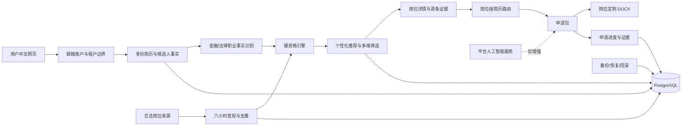

# 架构与业务流

## 关键机制

1. **候选人事实层**：原始简历字节加密保存；解析结果、资质和用户确认分开记录。
2. **硬资格层**：年限、职级、资质、律师准入、执业证书、工作权利和雇主担保先于相似度排序。
3. **推荐层**：资格通过／待确认／不符合与相关性、机会潜力分别呈现，不使用伪精确录用率。
4. **简历路由层**：每个岗位重新比较用户所有简历；默认简历只作平分时次级因素。
5. **文档层**：使用已选简历和用户确认事实生成 DOCX；不修改原文件，不补造数字或职责。
6. **运行层**：Web、调度器、后台任务处理器和 PostgreSQL 分离；发现任务每六小时运行。
7. **降级层**：单一岗位来源或人工智能服务失败不拖垮其他来源和确定性规则。

## 数据权威

PostgreSQL 是业务数据权威。对象目录保存加密简历和备份；Private-Database、状态页或 R2 只在现有授权范围内承担运维投影或对象备份，不成为第二业务数据库。
