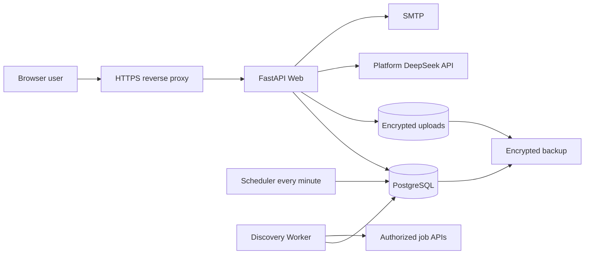

# Architecture

## Boundaries

- Web, Scheduler and Worker share one image and one PostgreSQL authority.
- Scheduler only queues due profiles. Worker claims queued runs, isolates source failures, updates recommendations and sets `next_discovery_at = completed_at + 6h`.
- Candidate PII and application content are encrypted at the application layer. Passwords use Argon2; sessions are server-side and versioned.
- Public jobs may deduplicate globally. Manually imported jobs include tenant identity in their canonical key and remain owner-scoped.
- DeepSeek is a bounded enhancement layer. Qualification hard rules remain deterministic.
- v0.2 SQLite is read-only during migration. The importer decrypts with the former key and re-encrypts with the v0.3 key; the old per-user DeepSeek key is never written to the business database.
