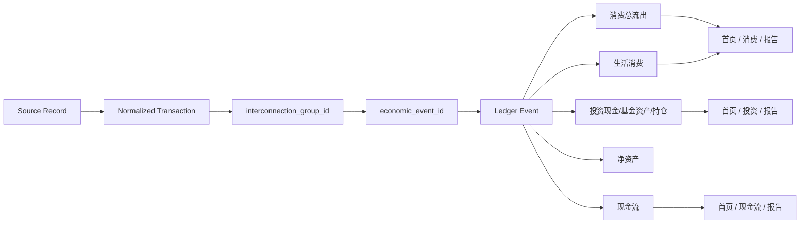

# Stage 4 - Economic Event 与 Interconnection 逻辑

## Interconnection Matrix

本矩阵定义同一笔钱如何从来源记录进入真实经济事件。核心规则是：可多处展示，但同一 `economic_event_id` 在同一指标口径只能计算一次；同一 `interconnection_group_id` 可包含多来源记录，但不得重复计入核心金额。

| event_type | 中文名称 | 消费总流出 | 生活消费 | 投资 | 净资产 | 现金流 | 抵消规则 |
|---|---|---:|---:|---:|---:|---:|---|
| `consumption` / `ordinary_consumption` | 普通消费 | 是 | 是 | 否 | 减少 | 生活现金流出 | 退款抵消原消费 |
| `investment_deposit` | 投资入金 | 是 | 否 | 投资现金增加 | 不变 | 生活现金流出、投资现金流入 | 银行侧与券商侧同属一个 interconnection_group，只按一个 economic_event_id 计算一次 |
| `fund_subscription` | 基金申购 | 是 | 否 | 基金资产增加 | 不变 | 主钱包或基金平台现金流出 | 支付记录和基金份额记录归入一个 economic_event_id |
| `bullion_purchase` | 黄金申购 | 是 | 否 | 贵金属资产增加 | 不变 | 现金流出 | 支付记录和贵金属持仓记录只按一个 economic_event_id 计算一次 |
| `investment_buy` | 投资买入 | 是 | 否 | 投资持仓增加 | 不变 | 投资账户现金流出 | 现金减少和持仓增加同属一个 economic_event_id，不能重复计入总流出 |
| `investment_sell` | 投资卖出 | 否 | 否 | 投资现金回流 | 不变 | 投资账户现金流入 | 卖出资金回流不抵消生活消费 |
| `refund` | 退款 | 抵消 | 抵消 | 否 | 增加 | 现金流入 | 退款抵消原消费；有 `offset_economic_event_id` 时绑定原事件 |
| `credit_card_repayment` | 信用卡还款 | 否 | 否 | 否 | 通常不变 | 生活现金流出 | 信用卡还款不重复计入生活消费；原消费已在账单发生时计算 |
| `internal_transfer` | 内部转账 | 否 | 否 | 否 | 不变 | 内部现金移动 | 转出和转入记录必须归入同一 interconnection_group |
| `income` | 收入 | 否 | 否 | 否 | 增加 | 现金流入 | 收入不抵消消费 |
| `fee` | 费用 | 是 | 否 | 可作为金融费用分析 | 减少 | 现金流出 | 若退费则由 refund 事件抵消 |
| `fx_conversion` | 汇率兑换 | 否 | 否 | 否 | 不变 | 币种间现金移动 | 兑换两侧必须归入同一 interconnection_group，CNY 主口径不重复计算 |

## Metric Dependency Graph

## 单次计算规则

- `total_consumption_outflow_cny` 来源：普通消费、投资入金、基金申购、黄金申购、投资买入、费用、退款抵消。
- `living_consumption_cny` 来源：普通消费、退款抵消。
- `investment_cash_cny` 来源：投资入金、投资卖出回流。
- `fund_asset_flow_cny` 来源：基金申购。
- `investment_holding_flow_cny` 来源：投资买入、投资卖出。
- `cashflow` 来源：收入、退款、信用卡还款、内部转账、汇率兑换。

## Stage 4 - Economic Event 与 Interconnection 逻辑验收

- `economic_event_id`：同一真实事件只有一个 ID。
- `interconnection_group_id`：银行转 Moomoo、支付宝买基金、退款、信用卡还款等关联记录进入同一组。
- Agent 1：复核消费、投资、现金流口径；投资入金未进入消费总流出时阻塞，投资入金进入生活消费时阻塞。
- Agent 2：复核 source -> transaction -> group -> economic event -> ledger -> metric 链路；同一 interconnection_group 重复计入核心金额时阻塞。
