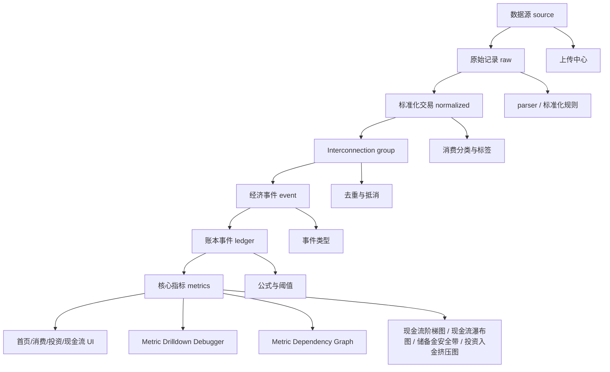

# Stage 9 - 可视化与 UI/UX Interconnection Map

本文件是 `S9-P2-T1` 的 Mermaid 交付物，服务于 Stage 9 - 可视化与 UI/UX 的人工验收。它说明 PFI v0.2.2 的指标不是孤立页面结果，而是从数据源、原始记录、标准化交易、经济事件、账本事件、指标和 UI 逐层派生。

## Mermaid 关系图

## Stage 9 任务覆盖

| Task ID | 对应节点 | 验收说明 |
| --- | --- | --- |
| `S9-P1-T1` | 参数中心 | 显示货币、汇率、分类、标签、阈值、公式、置信度、现金流窗口。 |
| `S9-P1-T2` | 参数中心 | 每个参数显示中文名、当前值、作用、影响范围、是否可修改。 |
| `S9-P1-T3` | 参数中心 | 修改阈值前显示影响记录数、标签数、建议数、图表数。 |
| `S9-P2-T1` | Interconnection Map | 本文件提供可审查 graph，不只提供文字。 |
| `S9-P2-T2` | `web/interconnection-map.html` | 本地 HTML 可点击数据源、事件类型、分类、标签、公式、影响板块。 |
| `S9-P2-T3` | 数据状态 | 每个图表显示参数版本、公式版本、汇率快照、hash、缓存和是否需要重算。 |
| `S9-P3-T1` | 现金流阶梯图 | 展示 7/21/30/60/90/180/360 天窗口。 |
| `S9-P3-T2` | 现金流瀑布图 | 展示当前现金、收入、退款、固定支出、弹性支出、信用卡、投资入金、投资回流。 |
| `S9-P3-T3` | 储备金安全带 | 展示绿色、黄色、红色现金安全区间。 |
| `S9-P3-T4` | 投资入金挤压图 | 说明投资入金对生活现金和储备金的影响。 |
| `S9-P4-T1` | Metric Drilldown Debugger | 首页总览核心数字可追踪来源记录、公式、参数、排除项、抵消项。 |
| `S9-P4-T2` | Metric Drilldown Debugger | 展示纳入、排除、调整。 |
| `S9-P4-T3` | Metric Drilldown Debugger | 展示置信度、匹配率、最后更新时间、计算耗时、缓存状态。 |

## 可点击 HTML 关系

本地 HTML：`PFI/web/interconnection-map.html`

必须可点击追踪：

- 数据源
- 事件类型
- 分类
- 标签
- 公式
- 影响板块

## 与 Metric Dependency Graph 的关系

Metric Dependency Graph 用于解释指标之间的依赖和重算范围。Stage 9 只做可视化与人工验收入口，不改变 Stage 8 Runtime Diff 的重算策略。

关键口径：

- 投资入金、基金申购、黄金申购、投资买入进入 `消费总流出`。
- 投资入金、基金申购、黄金申购、投资买入不进入 `生活消费`。
- 现金流阶梯图、现金流瀑布图、储备金安全带、投资入金挤压图必须从统一账本和参数版本派生。
- Metric Drilldown Debugger 必须显示纳入、排除、调整和质量状态。
