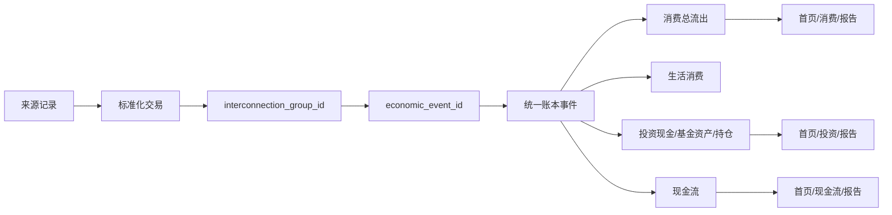

# PFI v0.2.2 Stage 4 - Economic Event 与 Interconnection 逻辑

## 目标

本轮完成 Stage 4：把多来源记录归并为真实经济事件，建立 `economic_event_id`、`interconnection_group_id`、事件影响 flags、Interconnection Matrix 和 Metric Dependency Graph，确保多来源记录不会重复计算。

2026-06-28 复审并解决更新：补齐同一 `interconnection_group_id` 下来源两侧 `economic_event_id` 不一致时的核心金额去重规则，并补齐现金流依赖图中的投资与费用现金事件。

## Task 验收

| Task ID | 交付物 | 验收标准 | 状态 |
|---|---|---|---|
| `S4-P1-T1` | `InterconnectionRecord.economic_event_id` | 多来源记录可归并为一个真实经济事件 | 完成 |
| `S4-P1-T2` | `InterconnectionRecord.interconnection_group_id` | 银行转 Moomoo、支付宝买基金、退款、信用卡还款可形成关联组 | 完成 |
| `S4-P1-T3` | `EventTypePolicy` flags | 每个 event_type 写清首页、消费、投资、现金流、报告处理方式 | 完成 |
| `S4-P2-T1` | `docs/pfi_v02/INTERCONNECTION_MATRIX.md` | 覆盖普通消费、投资入金、基金申购、黄金申购、投资买入、投资卖出、退款、信用卡还款、内部转账、收入、费用、汇率兑换 | 完成 |
| `S4-P2-T2` | Matrix 字段 | 写明是否计入消费总流出、生活消费、投资、净资产、现金流 | 完成 |
| `S4-P2-T3` | 抵消规则 | 退款抵消原消费；信用卡还款不重复计入生活消费；投资入金计入消费总流出但不计入生活消费 | 完成 |

## 核心口径

- 普通消费：计入消费总流出和生活消费。
- 投资入金：计入消费总流出，不计入生活消费，计入投资现金。
- 基金申购：计入消费总流出，不计入生活消费，计入基金资产。
- 黄金申购：计入消费总流出，不计入生活消费，计入贵金属资产。
- 投资买入：计入消费总流出，不计入生活消费，计入投资持仓。
- 退款：抵消生活消费或对应总流出。
- 信用卡还款：不能重复计入生活消费。

## Stop Condition 复核

| Stop Condition | 处理 |
|---|---|
| 同一记录被重复计入核心金额 | `aggregate_core_metrics()` 先按 `interconnection_group_id + event_type` 去重；缺少关联组时按 `economic_event_id + event_type` 兜底。 |
| 同一 interconnection_group 因重复来源记录导致核心金额重复计算 | 银行侧、券商侧、基金份额侧、支付侧如处于同一关联组和同一核心事件类型，只保留一笔核心金额。 |
| 投资入金未进入消费总流出 | `investment_deposit.affects_total_consumption_outflow=true`，测试覆盖。 |
| 基金申购未进入消费总流出 | `fund_subscription.affects_total_consumption_outflow=true`，测试覆盖。 |
| 投资入金错误进入生活消费 | `investment_deposit.affects_living_consumption=false`，测试覆盖。 |

## Metric Dependency Graph



## Agent 交叉复审

- Agent 1：消费、投资、现金流模型复审通过；投资入金、基金申购、投资买入进入消费总流出但不进入生活消费。
- Agent 2：数据源与 Interconnection 复审通过；source -> transaction -> group -> economic event -> ledger -> metric 链路已在矩阵和测试中闭环。

## 复审修复

- 修复 1：按 `interconnection_group_id + event_type` 防止重复核心计量。若 CBA 出金和 Moomoo 入金同属一个 `interconnection_group_id`，即使来源侧暂时生成了不同 `economic_event_id`，消费总流出、投资现金和现金流指标也只计算一次。
- 修复 2：补齐现金流依赖图的投资与费用事件。`cashflow` 现在包含投资入金、基金申购、黄金申购、投资买入、投资卖出、收入、费用、退款、信用卡还款、内部转账和汇率兑换。
- 本轮复审报告：`docs/pfi_v022/reviews/STAGE4_REVIEW_20260628.md`。
- 本轮复审测试：`tests/test_v022_review_stage4.py`。

## Validation

```bash
PYTHONDONTWRITEBYTECODE=1 PYTHONPATH=src python3 -B -m pytest tests/test_v022_review_stage4.py -q -p no:cacheprovider
PYTHONDONTWRITEBYTECODE=1 PYTHONPATH=src python3 -B -m pytest tests/test_v022_interconnection_no_double_count.py tests/test_v022_consumption_investment_outflow.py tests/test_v022_review_stage4.py tests/test_v022_review_stage3.py tests/test_pfi_parameters_consistency.py -q -p no:cacheprovider
PYTHONDONTWRITEBYTECODE=1 PYTHONPATH=src python3 -B -m pytest tests -q -p no:cacheprovider
python3 scripts/validate_project_governance.py --project PFI
node --check web/app/shell.js
git diff --check -- PFI
```
