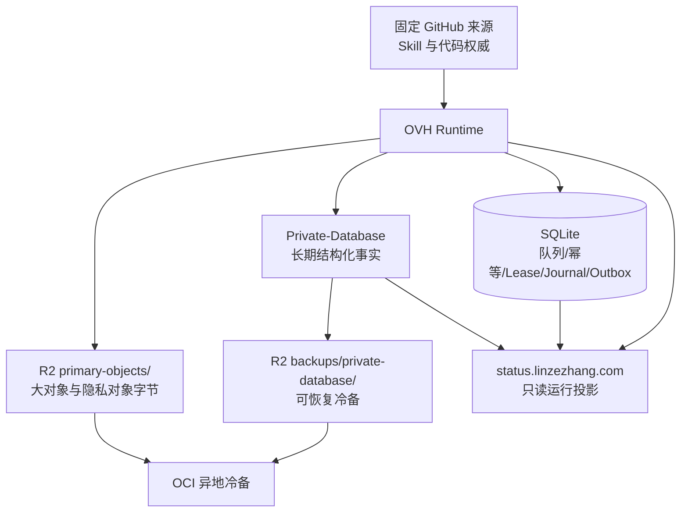

# 数据权威与耦合架构

```mermaid
flowchart TB
  G[固定 GitHub 来源\nSkill 与代码权威] --> O[OVH Runtime]
  O --> Q[(SQLite\n队列/幂等/Lease/Journal/Outbox)]
  O --> P[Private-Database\n长期结构化事实]
  O --> R2A[R2 primary-objects/\n大对象与隐私对象字节]
  P --> R2B[R2 backups/private-database/\n可恢复冷备]
  R2A --> OCI[OCI 异地冷备]
  R2B --> OCI
  P --> ST[status.linzezhang.com\n只读运行投影]
  Q --> ST
  O --> ST
```

Status 是所有开发任务的第一步预检和最后一步收尾，但不是第二业务事实源。
