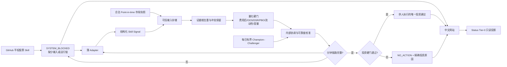

# 北极星功能架构

```mermaid
flowchart LR
  A[GitHub 平权股票 Skill] --> B[只读来源跟踪与版本快照]
  X[PFI / EEI / QBE / QBVS / QVE / Serenity / Alpha] --> C[薄 Adapter]
  B --> C
  C --> D[结构化 Skill Signal]
  M[合法 Point-in-time 市场快照] --> E[可信输入存储]
  D --> E
  E --> F[证据根去重与冲突保留]
  F --> G[量化硬门\n费用后/OOS/DSR/PBO/流动性/容量]
  G --> H[内部协调与可靠度校准]
  H --> X{分钟链路完整?}
  X -- 否 --> B[ SYSTEM_BLOCKED\n缺少输入或运行链 ]
  X -- 是 --> I{投资硬门通过?}
  I -- 是 --> J[供人执行的唯一投资建议]
  I -- 否 --> K[NO_ACTION + 精确投资原因]
  B --> L[中文网站]
  J --> L
  K --> L
  L --> S[Status Tier-0 只读投影]
  R[每日有界 Champion–Challenger] --> H
```

所有 Skill 平权；不存在母 Skill。运行期无 Agent、无 LLM、无自动交易。
