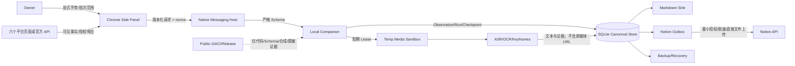

# Threat Model — Stage 0 / Phase 0.5

## 安全目标与资产

最高价值资产是：平台会话/系统 Keychain 引用、Owner 私有内容与关系、SQLite Canonical Store、分类体系、Notion 授权、证据/备份、构建/更新信任链。平台 CDN URL 和原始媒体不是长期资产，必须在 Lease 到期前销毁。

## Data Flow Diagram

## Trust Boundaries

| ID | 边界 | 默认信任 |
|---|---|---|
| TB-01 | Owner ↔ Side Panel | 只信任当前明确手势，不推断未来批次 |
| TB-02 | 平台 DOM/API ↔ Extension | 全部外部不可信；可能漂移、注入、诱导 |
| TB-03 | Extension ↔ Native Host | Origin/Schema/Size/Nonce 全校验 |
| TB-04 | Native Host ↔ Companion | 只允许固定动作，不允许 Shell/任意 Path/URL |
| TB-05 | Companion ↔ SQLite | 事务、Migration、唯一键、最小文件权限 |
| TB-06 | Companion ↔ Temp Media | Sandbox、Lease、Quota、Parser 隔离 |
| TB-07 | Companion ↔ 平台/Redirect/DNS | SSRF 防火墙逐跳 Fail Closed |
| TB-08 | Companion ↔ 模型 Provider | 默认关闭；内容外发需 Owner 明确授权 |
| TB-09 | Outbox ↔ Notion | 最小 capability、Rate Limit、幂等 Receipt |
| TB-10 | Private Runtime ↔ Git/CI/Release | 单向禁止私有数据外流，扫描阻断 |

## STRIDE Register

| 威胁 | 代表性攻击/故障 | 设计控制 | Fail-closed 结果 |
|---|---|---|---|
| Spoofing | 伪造 Extension Origin、Native Host、平台 Host、Notion 回执 | 精确 origin、签名构建、TLS/Host allowlist、request/receipt ID | 拒绝并熔断相关通道 |
| Tampering | DOM 注入、Schema Drift、Checkpoint/DB/Artifact 被改 | 版本 Schema、Hash、事务、FK/Unique、备份完整性 | `platform_changed`/恢复，不写 Sink |
| Repudiation | 无法证明谁选择了批次、请求成功但 Receipt 丢失 | Intent/gesture scope、Run ID、Outbox、不可变 Evidence Receipt | 保持 pending，先 reconcile |
| Information Disclosure | Cookie/Header/正文/CDN URL/绝对路径进入日志或 Git | Allowlist 日志、Keychain 引用、URL scrub、Secret/CDN/Private 扫描 | 停止发布、轮换 Secret、隔离证据 |
| Denial of Service | 超大媒体、压缩炸弹、FFmpeg hang、429、无限分页 | Size/MIME/Duration/CPU/Disk/Deadline/并发 1、Retry-After、取消 | 降级 text-only 或单平台停用 |
| Elevation of Privilege | 任意 Shell/Path/URL、路径穿越、SSRF、Prompt Injection 调工具 | 无 Shell contract、路径 capability、SSRF firewall、模型无工具权限 | 拒绝 100%，记录安全事件 |

## SSRF 与恶意输入细化

下载器必须先解析再连接，并对每次 DNS 解析及 Redirect 重验：仅 HTTPS、精确平台 Host/Suffix allowlist、Port 443、公共可路由 IP；拒绝 loopback、RFC1918、carrier-grade NAT、link-local、multicast、unspecified、IPv4-mapped IPv6、metadata、userinfo、非 HTTP(S)、IP literal、DNS rebinding 和超过 Redirect 上限。响应先检查 Content-Length/MIME，再有限流 Stream；缺长度也受总字节预算。输出路径由 Lease ID 推导，不接收远端文件名或用户任意路径。

## Misuse Cases

1. Owner 粘贴任意 URL 让 Companion 充当代理：拒绝，必须来自平台 Adapter 的不可持久化 Lease capability。
2. 页面文字要求模型泄露 Secret/改分类/运行命令：视为不可信内容，不进入系统指令，模型无工具和分类写权限。
3. 批量列表返回空数组：不得推断全部取消收藏；标记 anomaly，历史关系不删除。
4. CAPTCHA/验证弹窗出现：暂停并请求 Owner 手工处理；不截图外发、不自动点击、不绕过。
5. 平台限流：遵守 Retry-After/指数退避；达到预算即本平台 Kill，不切代理/指纹。
6. 成功写 Notion 后本地崩溃：用 idempotency key/reconcile 找回 Receipt，禁止盲目重建 Page。
7. 竞品/依赖建议复制 Cookie 或签名 JS：License/Policy Gate 阻断；只允许 clean-room 通用思想。
8. 真实 Fixture 被误提交：Pre-commit/CI Private-data Canary 阻断；删除前先隔离、轮换 Secret、评估历史清理。

## 数据生命周期

| 数据 | 可进入位置 | 保留策略 | 禁止位置 |
|---|---|---|---|
| Cookie/Token/Profile | Browser Profile/Keychain 引用 | Owner/平台会话生命周期 | IPC Payload、SQLite、日志、Git、Notion |
| 平台媒体 URL | 单进程内 Lease | 完成/错误/Deadline 后销毁 | 所有持久层和证据 |
| 原始媒体 | `runtime/temp_media` | 成功立即删除；失败 ≤24h | Git、Backups、Markdown、Notion、长期 downloads |
| Canonical 文本/关系 | SQLite | Owner retention/delete contract | Public Artifact |
| ASR/OCR/关键帧证据 | SQLite/derived sinks | 版本化，可重建 | 未授权云 Provider |
| 合成 Fixture | Git | 版本化 | 真实域名、账号、CDN、私有路径 |

## 残余风险与准入

- 平台政策、Scope 和 DOM 会变化；每个实际 Platform Phase 开始时重新核验，未知即禁用。
- 浏览器 Profile 本身是高价值本地资产；Stage 3 前需验证文件权限、互斥、备份排除与诊断脱敏。
- 媒体 Parser 仍可能有 0-day；Stage 4 前需要进程隔离、资源限制和依赖漏洞 Gate。
- 本 Phase 只证明模型和合成用例完整，不证明运行控制有效；`ACC.x2n.media.003` 和 `ACC.x2n.rel.003` 的实现/发布范围保持 `DOWNSTREAM_NOT_RUN`。
